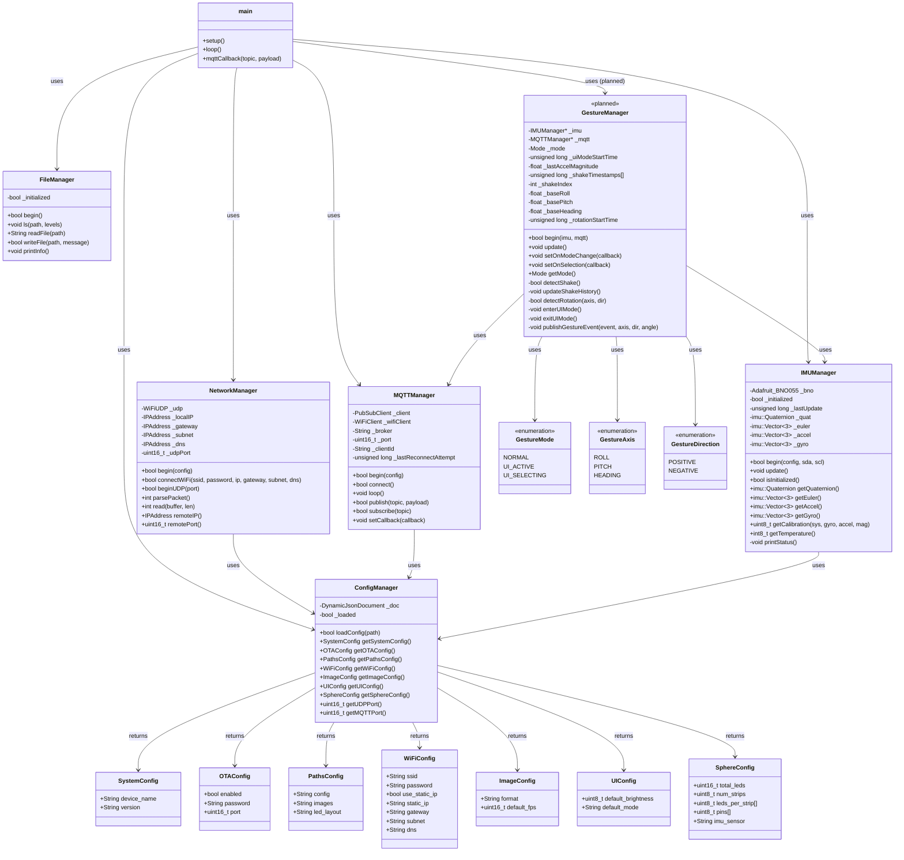
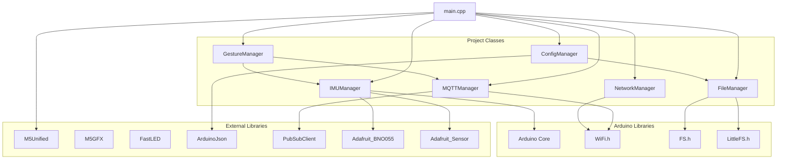
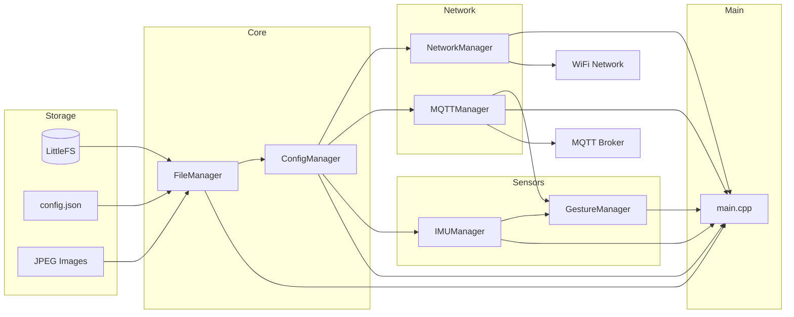

> [English](class.md) · **日本語**

# クラス図

## システム全体構成

```mermaid
classDiagram
    class main {
        +setup()
        +loop()
        +mqttCallback(topic, payload)
    }

    class FileManager {
        -bool _initialized
        +bool begin()
        +void ls(path, levels)
        +String readFile(path)
        +bool writeFile(path, message)
        +void printInfo()
    }

    class ConfigManager {
        -DynamicJsonDocument _doc
        -bool _loaded
        +bool loadConfig(path)
        +SystemConfig getSystemConfig()
        +OTAConfig getOTAConfig()
        +PathsConfig getPathsConfig()
        +WiFiConfig getWiFiConfig()
        +ImageConfig getImageConfig()
        +UIConfig getUIConfig()
        +SphereConfig getSphereConfig()
        +uint16_t getUDPPort()
        +uint16_t getMQTTPort()
    }

    class NetworkManager {
        -WiFiUDP _udp
        -IPAddress _localIP
        -IPAddress _gateway
        -IPAddress _subnet
        -IPAddress _dns
        -uint16_t _udpPort
        +bool begin(config)
        +bool connectWiFi(ssid, password, ip, gateway, subnet, dns)
        +bool beginUDP(port)
        +int parsePacket()
        +int read(buffer, len)
        +IPAddress remoteIP()
        +uint16_t remotePort()
    }

    class MQTTManager {
        -PubSubClient _client
        -WiFiClient _wifiClient
        -String _broker
        -uint16_t _port
        -String _clientId
        -unsigned long _lastReconnectAttempt
        +bool begin(config)
        +bool connect()
        +void loop()
        +bool publish(topic, payload)
        +bool subscribe(topic)
        +void setCallback(callback)
    }

    class IMUManager {
        -Adafruit_BNO055 _bno
        -bool _initialized
        -unsigned long _lastUpdate
        -imu::Quaternion _quat
        -imu::Vector~3~ _euler
        -imu::Vector~3~ _accel
        -imu::Vector~3~ _gyro
        +bool begin(config, sda, scl)
        +void update()
        +bool isInitialized()
        +imu::Quaternion getQuaternion()
        +imu::Vector~3~ getEuler()
        +imu::Vector~3~ getAccel()
        +imu::Vector~3~ getGyro()
        +uint8_t getCalibration(sys, gyro, accel, mag)
        +int8_t getTemperature()
        -void printStatus()
    }

    class GestureManager {
        <<planned>>
        -IMUManager* _imu
        -MQTTManager* _mqtt
        -Mode _mode
        -unsigned long _uiModeStartTime
        -float _lastAccelMagnitude
        -unsigned long _shakeTimestamps[]
        -int _shakeIndex
        -float _baseRoll
        -float _basePitch
        -float _baseHeading
        -unsigned long _rotationStartTime
        +bool begin(imu, mqtt)
        +void update()
        +void setOnModeChange(callback)
        +void setOnSelection(callback)
        +Mode getMode()
        -bool detectShake()
        -void updateShakeHistory()
        -bool detectRotation(axis, dir)
        -void enterUIMode()
        -void exitUIMode()
        -void publishGestureEvent(event, axis, dir, angle)
    }

    class GestureMode {
        <<enumeration>>
        NORMAL
        UI_ACTIVE
        UI_SELECTING
    }

    class GestureAxis {
        <<enumeration>>
        ROLL
        PITCH
        HEADING
    }

    class GestureDirection {
        <<enumeration>>
        POSITIVE
        NEGATIVE
    }

    %% 構成データ構造
    class SystemConfig {
        +String device_name
        +String version
    }

    class OTAConfig {
        +bool enabled
        +String password
        +uint16_t port
    }

    class PathsConfig {
        +String config
        +String images
        +String led_layout
    }

    class WiFiConfig {
        +String ssid
        +String password
        +bool use_static_ip
        +String static_ip
        +String gateway
        +String subnet
        +String dns
    }

    class ImageConfig {
        +String format
        +uint16_t default_fps
    }

    class UIConfig {
        +uint8_t default_brightness
        +String default_mode
    }

    class SphereConfig {
        +uint16_t total_leds
        +uint8_t num_strips
        +uint8_t leds_per_strip[]
        +uint8_t pins[]
        +String imu_sensor
    }

    %% 依存関係
    main --> FileManager : uses
    main --> ConfigManager : uses
    main --> NetworkManager : uses
    main --> MQTTManager : uses
    main --> IMUManager : uses
    main --> GestureManager : uses (planned)

    ConfigManager --> SystemConfig : returns
    ConfigManager --> OTAConfig : returns
    ConfigManager --> PathsConfig : returns
    ConfigManager --> WiFiConfig : returns
    ConfigManager --> ImageConfig : returns
    ConfigManager --> UIConfig : returns
    ConfigManager --> SphereConfig : returns

    NetworkManager --> ConfigManager : uses
    MQTTManager --> ConfigManager : uses
    IMUManager --> ConfigManager : uses

    GestureManager --> IMUManager : uses
    GestureManager --> MQTTManager : uses
    GestureManager --> GestureMode : uses
    GestureManager --> GestureAxis : uses
    GestureManager --> GestureDirection : uses
```

## ライブラリ依存関係

```mermaid
graph TB
    subgraph "Arduino Libraries"
        Arduino[Arduino Core]
        WiFi[WiFi.h]
        FS[FS.h]
        LittleFS[LittleFS.h]
    end

    subgraph "External Libraries"
        M5Unified[M5Unified]
        M5GFX[M5GFX]
        FastLED[FastLED]
        ArduinoJson[ArduinoJson]
        PubSubClient[PubSubClient]
        AdafruitBNO055[Adafruit_BNO055]
        AdafruitSensor[Adafruit_Sensor]
    end

    subgraph "Project Classes"
        FileManager
        ConfigManager
        NetworkManager
        MQTTManager
        IMUManager
        GestureManager
    end

    FileManager --> LittleFS
    FileManager --> FS

    ConfigManager --> ArduinoJson
    ConfigManager --> FileManager

    NetworkManager --> WiFi

    MQTTManager --> PubSubClient
    MQTTManager --> WiFi

    IMUManager --> AdafruitBNO055
    IMUManager --> AdafruitSensor
    IMUManager --> Arduino

    GestureManager --> IMUManager
    GestureManager --> MQTTManager

    main[main.cpp] --> M5Unified
    main --> FileManager
    main --> ConfigManager
    main --> NetworkManager
    main --> MQTTManager
    main --> IMUManager
    main --> GestureManager
```

## モジュール間データフロー

```mermaid
flowchart LR
    subgraph Storage
        LittleFS[(LittleFS)]
        ConfigJSON[config.json]
        Images[JPEG Images]
    end

    subgraph Core
        FM[FileManager]
        CM[ConfigManager]
    end

    subgraph Network
        NM[NetworkManager]
        MM[MQTTManager]
    end

    subgraph Sensors
        IM[IMUManager]
        GM[GestureManager]
    end

    subgraph Main
        App[main.cpp]
    end

    LittleFS --> FM
    ConfigJSON --> FM
    Images --> FM

    FM --> CM
    CM --> NM
    CM --> MM
    CM --> IM

    IM --> GM
    MM --> GM

    FM --> App
    CM --> App
    NM --> App
    MM --> App
    IM --> App
    GM --> App

    NM --> WiFi[WiFi Network]
    MM --> MQTT[MQTT Broker]
```
