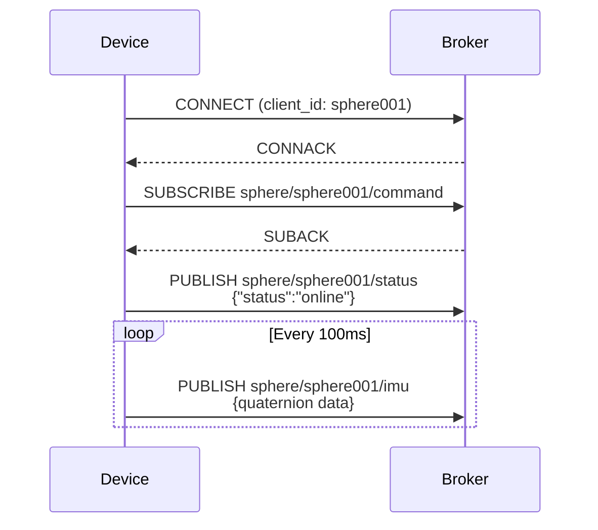
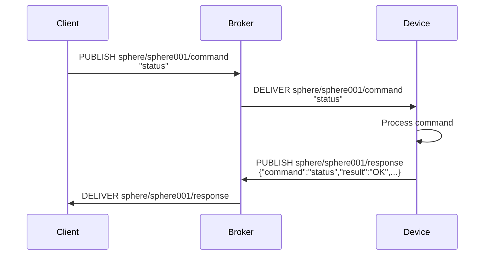
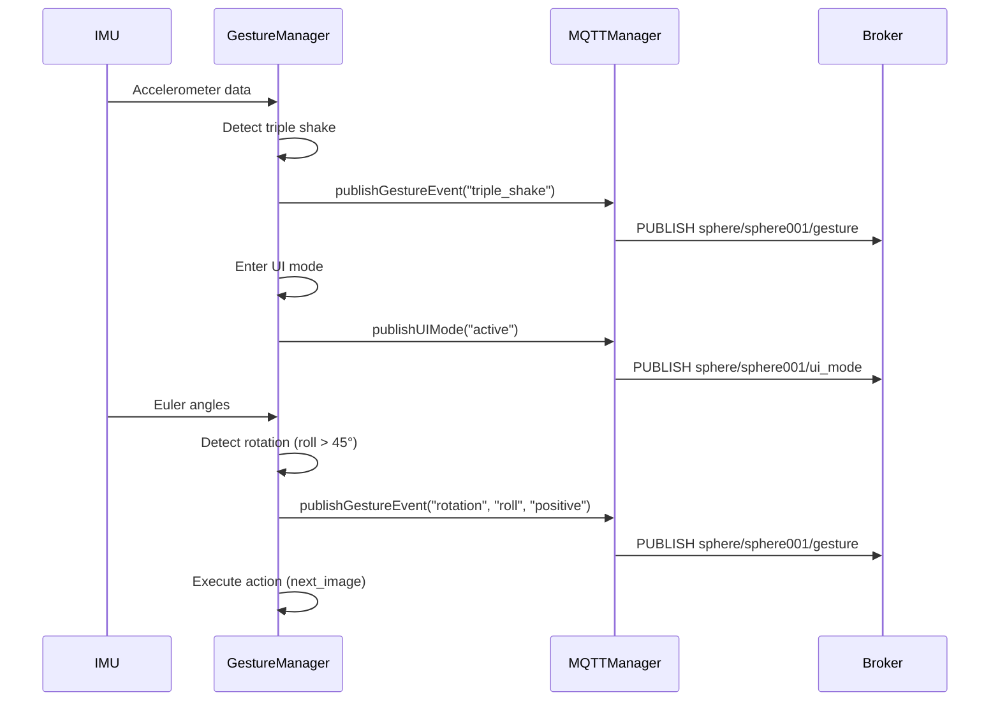

> [English](mqtt.md) · **日本語**

# MQTT プロトコル仕様

## 接続設定

### ブローカー情報
- **ホスト**: 192.168.49.1
- **ポート**: 1883
- **プロトコル**: MQTT v3.1.1
- **認証**: Anonymous (認証なし)
- **Keep Alive**: 15秒
- **QoS**: 0 (At most once)

### クライアント情報
- **Client ID**: `sphere001` (config.jsonで設定)
- **Clean Session**: true
- **再接続間隔**: 5秒

## トピック体系

### トピック命名規則
```
sphere/{device_id}/{category}
```

### デバイスID
- **sphere001**: メインデバイス (config.jsonで設定可能)

## パブリッシュトピック (デバイス → ブローカー)

### 1. sphere/sphere001/status
デバイスの状態通知

**ペイロード**:
```json
{
  "status": "online" | "offline",
  "timestamp": 1234567890
}
```

**送信タイミング**:
- MQTT接続時 (status: "online")
- 正常シャットダウン時 (status: "offline")

---

### 2. sphere/sphere001/imu
IMUセンサーデータ (クォータニオン)

**ペイロード**:
```json
{
  "w": 0.7042,
  "x": 0.3469,
  "y": 0.6196,
  "z": 0.0000
}
```

**データ仕様**:
- `w`: クォータニオン w成分 (スカラー部)
- `x`: クォータニオン x成分
- `y`: クォータニオン y成分
- `z`: クォータニオン z成分
- 値範囲: -1.0 ~ 1.0
- 精度: 小数点4桁

**送信タイミング**:
- 10Hz (100msごと)
- IMU初期化成功後のみ

---

### 3. sphere/sphere001/response
コマンドに対する応答

**ペイロード**:
```json
{
  "command": "status",
  "result": "OK",
  "data": {
    "device": "sphere001",
    "uptime": 12345,
    "free_heap": 234567,
    "imu_calibration": {
      "sys": 3,
      "gyro": 3,
      "accel": 3,
      "mag": 3
    }
  }
}
```

**フィールド**:
- `command`: 実行したコマンド名
- `result`: "OK" | "ERROR"
- `data`: コマンド固有の応答データ (任意)

**送信タイミング**:
- コマンド受信時の応答

---

### 4. sphere/sphere001/gesture
ジェスチャーイベント通知 (実装予定)

**ペイロード例1: トリプルシェイク検出**
```json
{
  "event": "triple_shake",
  "timestamp": 1234567890
}
```

**ペイロード例2: 回転ジェスチャー**
```json
{
  "event": "rotation",
  "axis": "roll" | "pitch" | "heading",
  "direction": "positive" | "negative",
  "angle": 52.3,
  "action": "next_image" | "prev_image" | "brightness_up" | "brightness_down" | "next_mode" | "prev_mode"
}
```

**送信タイミング**:
- ジェスチャー検出時

---

### 5. sphere/sphere001/ui_mode
UIモード状態通知 (実装予定)

**ペイロード**:
```json
{
  "mode": "normal" | "active" | "selecting",
  "timeout": 10000
}
```

**送信タイミング**:
- UIモード遷移時

---

## サブスクライブトピック (ブローカー → デバイス)

### 1. sphere/sphere001/command
デバイス制御コマンド

**ペイロード形式**: プレーンテキスト

**サポートコマンド**:

#### status
デバイス状態問い合わせ
```
status
```

**応答**: `sphere/sphere001/response`にJSON形式で返信

---

#### restart
デバイス再起動
```
restart
```

**動作**: ESP32をソフトウェアリセット

---

#### set_brightness
LED輝度設定 (実装予定)
```
set_brightness:128
```

**パラメータ**: 0-255

---

#### show_image
画像表示 (実装予定)
```
show_image:/images/demo01/frame_001.jpg
```

**パラメータ**: LittleFS上の画像パス

---

#### set_mode
表示モード変更 (実装予定)
```
set_mode:rotate
```

**パラメータ**: `static` | `rotate` | `animate`

---

## メッセージフロー

### 起動シーケンス


### コマンド実行シーケンス


### ジェスチャー検出シーケンス (実装予定)


## QoS設定

| トピック | QoS | 理由 |
|---------|-----|------|
| sphere/sphere001/status | 0 | 接続状態は再送不要 |
| sphere/sphere001/imu | 0 | 高頻度データ、ロストしても次が来る |
| sphere/sphere001/response | 0 | リクエスト再送で対応可能 |
| sphere/sphere001/gesture | 0 | リアルタイム性優先 |
| sphere/sphere001/ui_mode | 0 | 状態問い合わせで補完可能 |
| sphere/sphere001/command | 0 | 同期的な応答確認で十分 |

## エラーハンドリング

### 接続エラー
- **動作**: 5秒間隔で自動再接続
- **ログ**: シリアル出力で接続失敗を通知

### パブリッシュ失敗
- **動作**: エラーログ出力、次の送信を試行
- **影響**: IMUデータなど高頻度データは次のサイクルで上書き

### サブスクライブ失敗
- **動作**: 再接続時に再サブスクライブ
- **影響**: 一時的にコマンド受信不可

## セキュリティ考慮事項

### 現在の実装
- 認証なし (Anonymous接続)
- 暗号化なし (平文通信)
- ローカルネットワーク内での使用を想定

### 今後の改善案
- TLS/SSL対応 (ポート8883)
- ユーザー名/パスワード認証
- クライアント証明書認証
- ACL (Access Control List) による権限管理
