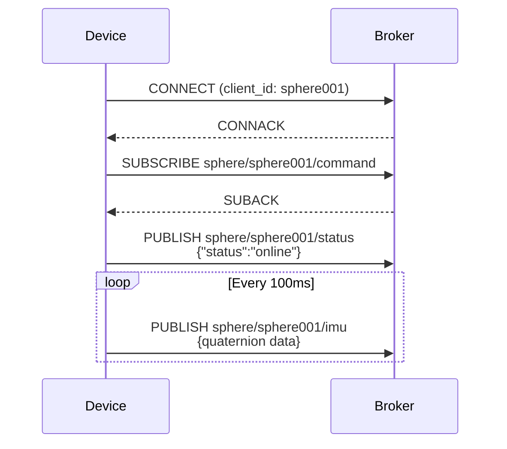
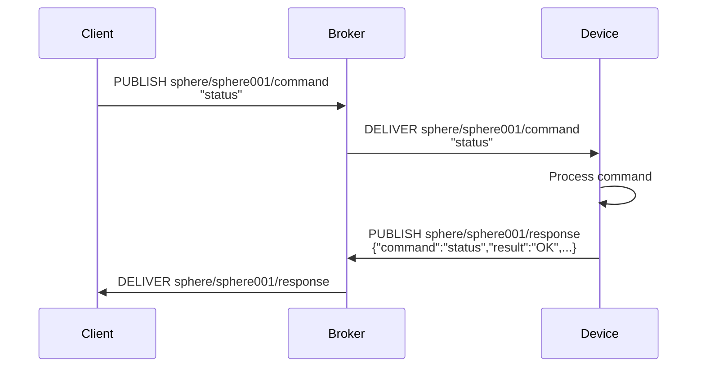
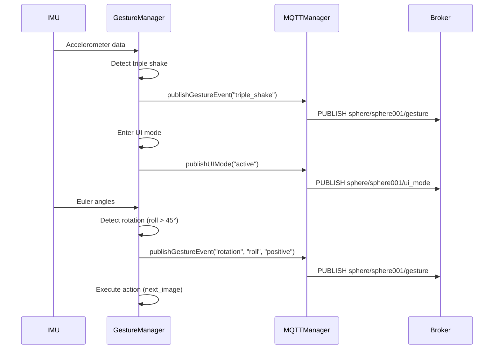

> **English** · [日本語](mqtt.ja.md)

# MQTT Protocol Specification

## Connection Settings

### Broker Information
- **Host**: 192.168.49.1
- **Port**: 1883
- **Protocol**: MQTT v3.1.1
- **Authentication**: Anonymous (no authentication)
- **Keep Alive**: 15 seconds
- **QoS**: 0 (At most once)

### Client Information
- **Client ID**: `sphere001` (configured in config.json)
- **Clean Session**: true
- **Reconnect interval**: 5 seconds

## Topic Structure

### Topic Naming Convention
```
sphere/{device_id}/{category}
```

### Device ID
- **sphere001**: Main device (configurable in config.json)

## Publish Topics (Device → Broker)

### 1. sphere/sphere001/status
Device status notification

**Payload**:
```json
{
  "status": "online" | "offline",
  "timestamp": 1234567890
}
```

**Send timing**:
- On MQTT connection (status: "online")
- On normal shutdown (status: "offline")

---

### 2. sphere/sphere001/imu
IMU sensor data (quaternion)

**Payload**:
```json
{
  "w": 0.7042,
  "x": 0.3469,
  "y": 0.6196,
  "z": 0.0000
}
```

**Data specification**:
- `w`: Quaternion w component (scalar part)
- `x`: Quaternion x component
- `y`: Quaternion y component
- `z`: Quaternion z component
- Value range: -1.0 ~ 1.0
- Precision: 4 decimal places

**Send timing**:
- 10Hz (every 100ms)
- Only after successful IMU initialization

---

### 3. sphere/sphere001/response
Response to a command

**Payload**:
```json
{
  "command": "status",
  "result": "OK",
  "data": {
    "device": "sphere001",
    "uptime": 12345,
    "free_heap": 234567,
    "imu_calibration": {
      "sys": 3,
      "gyro": 3,
      "accel": 3,
      "mag": 3
    }
  }
}
```

**Fields**:
- `command`: Name of the executed command
- `result`: "OK" | "ERROR"
- `data`: Command-specific response data (optional)

**Send timing**:
- Response when a command is received

---

### 4. sphere/sphere001/gesture
Gesture event notification (planned)

**Payload example 1: Triple shake detected**
```json
{
  "event": "triple_shake",
  "timestamp": 1234567890
}
```

**Payload example 2: Rotation gesture**
```json
{
  "event": "rotation",
  "axis": "roll" | "pitch" | "heading",
  "direction": "positive" | "negative",
  "angle": 52.3,
  "action": "next_image" | "prev_image" | "brightness_up" | "brightness_down" | "next_mode" | "prev_mode"
}
```

**Send timing**:
- On gesture detection

---

### 5. sphere/sphere001/ui_mode
UI mode status notification (planned)

**Payload**:
```json
{
  "mode": "normal" | "active" | "selecting",
  "timeout": 10000
}
```

**Send timing**:
- On UI mode transition

---

## Subscribe Topics (Broker → Device)

### 1. sphere/sphere001/command
Device control command

**Payload format**: Plain text

**Supported commands**:

#### status
Query device status
```
status
```

**Response**: Returned in JSON format to `sphere/sphere001/response`

---

#### restart
Restart the device
```
restart
```

**Behavior**: Software reset of the ESP32

---

#### set_brightness
Set LED brightness (planned)
```
set_brightness:128
```

**Parameter**: 0-255

---

#### show_image
Display image (planned)
```
show_image:/images/demo01/frame_001.jpg
```

**Parameter**: Image path on LittleFS

---

#### set_mode
Change display mode (planned)
```
set_mode:rotate
```

**Parameter**: `static` | `rotate` | `animate`

---

## Message Flow

### Startup sequence


### Command execution sequence


### Gesture detection sequence (planned)


## QoS Settings

| Topic | QoS | Reason |
|---------|-----|------|
| sphere/sphere001/status | 0 | Connection state does not need resending |
| sphere/sphere001/imu | 0 | High-frequency data; the next one arrives even if lost |
| sphere/sphere001/response | 0 | Can be handled by resending the request |
| sphere/sphere001/gesture | 0 | Real-time responsiveness takes priority |
| sphere/sphere001/ui_mode | 0 | Can be supplemented by a status query |
| sphere/sphere001/command | 0 | Synchronous response confirmation is sufficient |

## Error Handling

### Connection errors
- **Behavior**: Automatic reconnection every 5 seconds
- **Log**: Notifies of connection failures via serial output

### Publish failures
- **Behavior**: Output an error log and attempt the next send
- **Impact**: High-frequency data such as IMU data is overwritten in the next cycle

### Subscribe failures
- **Behavior**: Re-subscribe on reconnection
- **Impact**: Commands cannot be received temporarily

## Security Considerations

### Current implementation
- No authentication (Anonymous connection)
- No encryption (plaintext communication)
- Intended for use within a local network

### Future improvement proposals
- TLS/SSL support (port 8883)
- Username/password authentication
- Client certificate authentication
- Access control via ACL (Access Control List)
