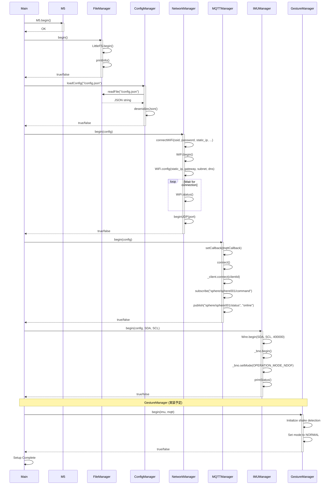
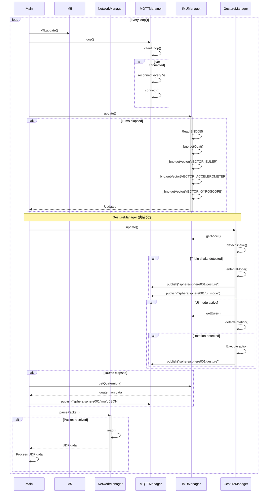
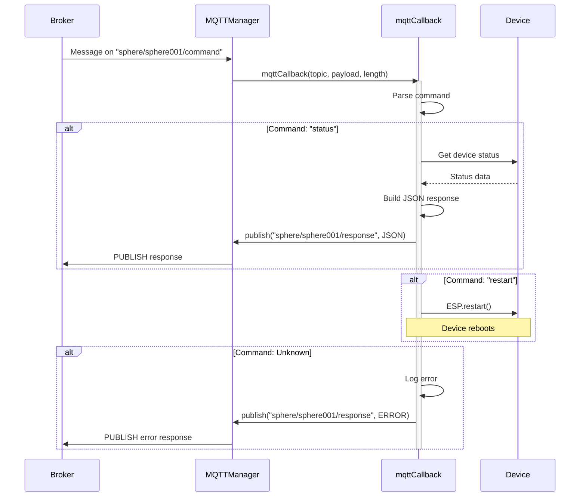
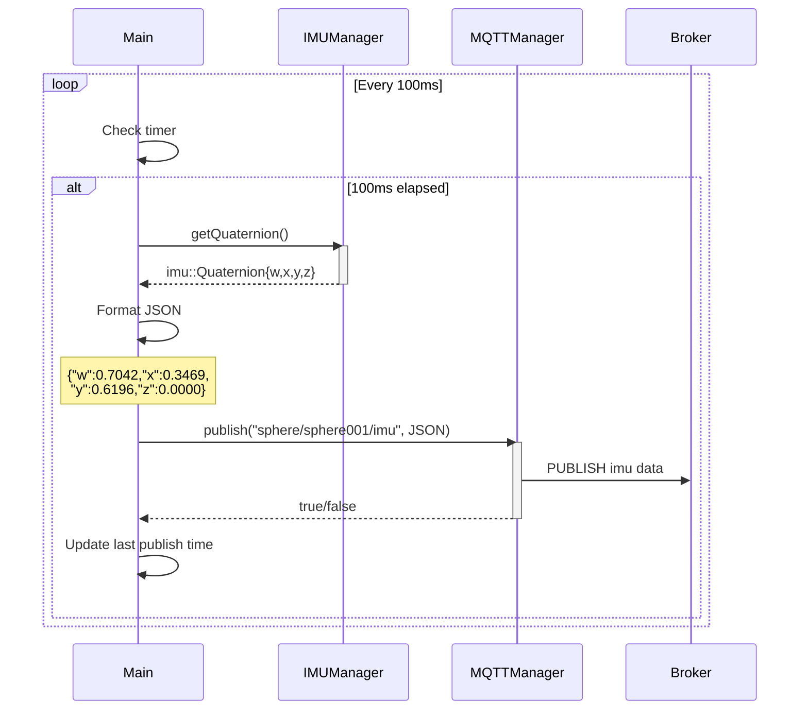
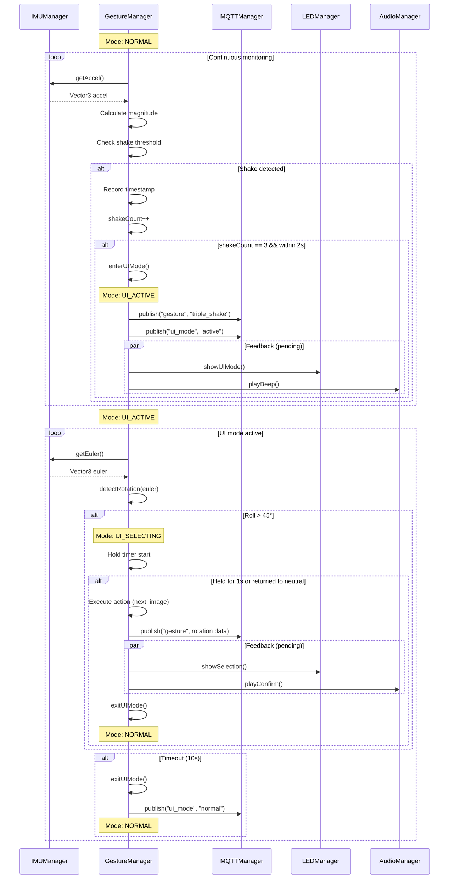
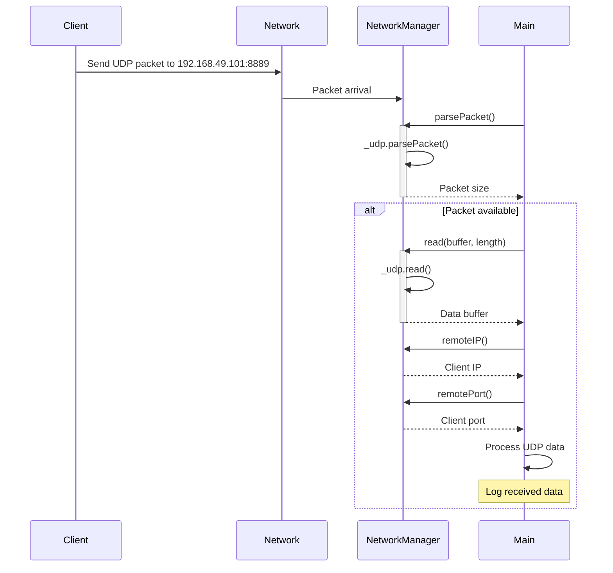
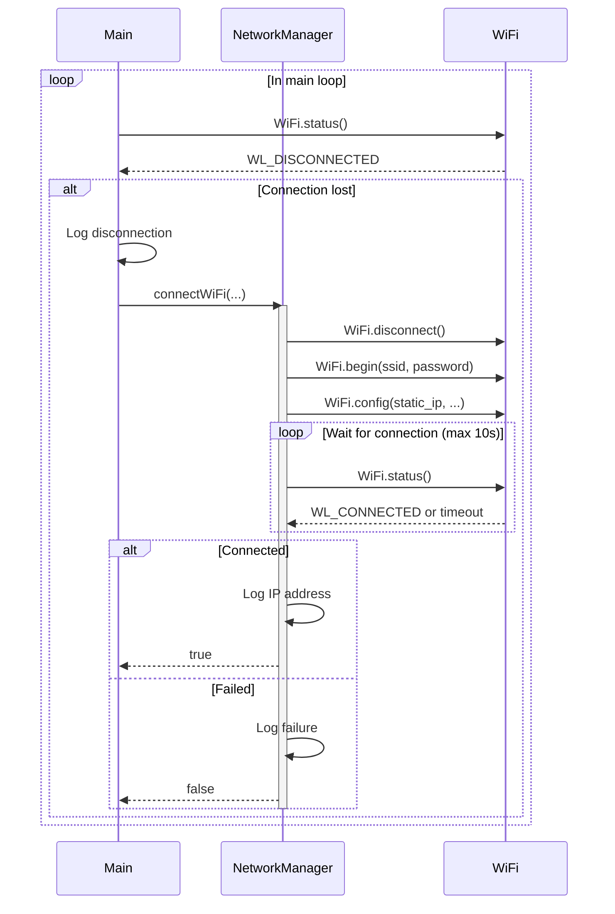
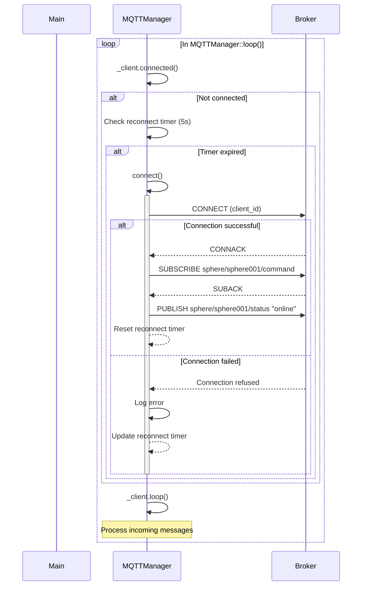

> [English](sequence.md) · **日本語**

# シーケンス図

## システム起動シーケンス

```mermaid
sequenceDiagram
    participant Main
    participant M5
    participant FM as FileManager
    participant CM as ConfigManager
    participant NM as NetworkManager
    participant MM as MQTTManager
    participant IM as IMUManager
    participant GM as GestureManager
    
    Main->>M5: M5.begin()
    activate M5
    M5-->>Main: OK
    deactivate M5
    
    Main->>FM: begin()
    activate FM
    FM->>FM: LittleFS.begin()
    FM->>FM: printInfo()
    FM-->>Main: true/false
    deactivate FM
    
    Main->>CM: loadConfig("/config.json")
    activate CM
    CM->>FM: readFile("/config.json")
    FM-->>CM: JSON string
    CM->>CM: deserializeJson()
    CM-->>Main: true/false
    deactivate CM
    
    Main->>NM: begin(config)
    activate NM
    NM->>NM: connectWiFi(ssid, password, static_ip, ...)
    NM->>NM: WiFi.begin()
    NM->>NM: WiFi.config(static_ip, gateway, subnet, dns)
    loop Wait for connection
        NM->>NM: WiFi.status()
    end
    NM->>NM: beginUDP(port)
    NM-->>Main: true/false
    deactivate NM
    
    Main->>MM: begin(config)
    activate MM
    MM->>MM: setCallback(mqttCallback)
    MM->>MM: connect()
    MM->>MM: _client.connect(clientId)
    MM->>MM: subscribe("sphere/sphere001/command")
    MM->>MM: publish("sphere/sphere001/status", "online")
    MM-->>Main: true/false
    deactivate MM
    
    Main->>IM: begin(config, SDA, SCL)
    activate IM
    IM->>IM: Wire.begin(SDA, SCL, 400000)
    IM->>IM: _bno.begin()
    IM->>IM: _bno.setMode(OPERATION_MODE_NDOF)
    IM->>IM: printStatus()
    IM-->>Main: true/false
    deactivate IM
    
    Note over Main,GM: GestureManager (実装予定)
    Main->>GM: begin(imu, mqtt)
    activate GM
    GM->>GM: Initialize shake detection
    GM->>GM: Set mode to NORMAL
    GM-->>Main: true/false
    deactivate GM
    
    Main->>Main: Setup Complete
```

## メインループシーケンス

```mermaid
sequenceDiagram
    participant Main
    participant M5
    participant NM as NetworkManager
    participant MM as MQTTManager
    participant IM as IMUManager
    participant GM as GestureManager
    
    loop Every loop()
        Main->>M5: M5.update()
        
        Main->>MM: loop()
        activate MM
        MM->>MM: _client.loop()
        alt Not connected
            MM->>MM: reconnect every 5s
            MM->>MM: connect()
        end
        deactivate MM
        
        Main->>IM: update()
        activate IM
        alt 10ms elapsed
            IM->>IM: Read BNO055
            IM->>IM: _bno.getQuat()
            IM->>IM: _bno.getVector(VECTOR_EULER)
            IM->>IM: _bno.getVector(VECTOR_ACCELEROMETER)
            IM->>IM: _bno.getVector(VECTOR_GYROSCOPE)
            IM-->>Main: Updated
        end
        deactivate IM
        
        Note over Main,GM: GestureManager (実装予定)
        Main->>GM: update()
        activate GM
        GM->>IM: getAccel()
        GM->>GM: detectShake()
        alt Triple shake detected
            GM->>GM: enterUIMode()
            GM->>MM: publish("sphere/sphere001/gesture")
            GM->>MM: publish("sphere/sphere001/ui_mode")
        end
        
        alt UI mode active
            GM->>IM: getEuler()
            GM->>GM: detectRotation()
            alt Rotation detected
                GM->>GM: Execute action
                GM->>MM: publish("sphere/sphere001/gesture")
            end
        end
        deactivate GM
        
        alt 100ms elapsed
            Main->>IM: getQuaternion()
            IM-->>Main: quaternion data
            Main->>MM: publish("sphere/sphere001/imu", JSON)
        end
        
        Main->>NM: parsePacket()
        activate NM
        alt Packet received
            NM->>NM: read()
            NM-->>Main: UDP data
            Main->>Main: Process UDP data
        end
        deactivate NM
    end
```

## MQTTコマンド処理シーケンス

```mermaid
sequenceDiagram
    participant Broker
    participant MM as MQTTManager
    participant Main as mqttCallback
    participant Device
    
    Broker->>MM: Message on "sphere/sphere001/command"
    MM->>Main: mqttCallback(topic, payload, length)
    activate Main
    
    Main->>Main: Parse command
    
    alt Command: "status"
        Main->>Device: Get device status
        Device-->>Main: Status data
        Main->>Main: Build JSON response
        Main->>MM: publish("sphere/sphere001/response", JSON)
        MM->>Broker: PUBLISH response
    end
    
    alt Command: "restart"
        Main->>Device: ESP.restart()
        Note over Main,Device: Device reboots
    end
    
    alt Command: Unknown
        Main->>Main: Log error
        Main->>MM: publish("sphere/sphere001/response", ERROR)
        MM->>Broker: PUBLISH error response
    end
    
    deactivate Main
```

## IMUデータ公開シーケンス

```mermaid
sequenceDiagram
    participant Main
    participant IM as IMUManager
    participant MM as MQTTManager
    participant Broker
    
    loop Every 100ms
        Main->>Main: Check timer
        
        alt 100ms elapsed
            Main->>IM: getQuaternion()
            activate IM
            IM-->>Main: imu::Quaternion{w,x,y,z}
            deactivate IM
            
            Main->>Main: Format JSON
            Note over Main: {"w":0.7042,"x":0.3469,<br/>"y":0.6196,"z":0.0000}
            
            Main->>MM: publish("sphere/sphere001/imu", JSON)
            activate MM
            MM->>Broker: PUBLISH imu data
            MM-->>Main: true/false
            deactivate MM
            
            Main->>Main: Update last publish time
        end
    end
```

## ジェスチャー検出シーケンス (実装予定)

```mermaid
sequenceDiagram
    participant IM as IMUManager
    participant GM as GestureManager
    participant MM as MQTTManager
    participant LED as LEDManager
    participant Audio as AudioManager
    
    Note over GM: Mode: NORMAL
    
    loop Continuous monitoring
        GM->>IM: getAccel()
        IM-->>GM: Vector3 accel
        
        GM->>GM: Calculate magnitude
        GM->>GM: Check shake threshold
        
        alt Shake detected
            GM->>GM: Record timestamp
            GM->>GM: shakeCount++
            
            alt shakeCount == 3 && within 2s
                GM->>GM: enterUIMode()
                Note over GM: Mode: UI_ACTIVE
                
                GM->>MM: publish("gesture", "triple_shake")
                GM->>MM: publish("ui_mode", "active")
                
                par Feedback (pending)
                    GM->>LED: showUIMode()
                    GM->>Audio: playBeep()
                end
            end
        end
    end
    
    Note over GM: Mode: UI_ACTIVE
    
    loop UI mode active
        GM->>IM: getEuler()
        IM-->>GM: Vector3 euler
        
        GM->>GM: detectRotation(euler)
        
        alt Roll > 45°
            Note over GM: Mode: UI_SELECTING
            GM->>GM: Hold timer start
            
            alt Held for 1s or returned to neutral
                GM->>GM: Execute action (next_image)
                GM->>MM: publish("gesture", rotation data)
                
                par Feedback (pending)
                    GM->>LED: showSelection()
                    GM->>Audio: playConfirm()
                end
                
                GM->>GM: exitUIMode()
                Note over GM: Mode: NORMAL
            end
        end
        
        alt Timeout (10s)
            GM->>GM: exitUIMode()
            GM->>MM: publish("ui_mode", "normal")
            Note over GM: Mode: NORMAL
        end
    end
```

## UDP受信シーケンス

```mermaid
sequenceDiagram
    participant Client
    participant Network
    participant NM as NetworkManager
    participant Main
    
    Client->>Network: Send UDP packet to 192.168.49.101:8889
    Network->>NM: Packet arrival
    
    Main->>NM: parsePacket()
    activate NM
    NM->>NM: _udp.parsePacket()
    NM-->>Main: Packet size
    deactivate NM
    
    alt Packet available
        Main->>NM: read(buffer, length)
        activate NM
        NM->>NM: _udp.read()
        NM-->>Main: Data buffer
        deactivate NM
        
        Main->>NM: remoteIP()
        NM-->>Main: Client IP
        
        Main->>NM: remotePort()
        NM-->>Main: Client port
        
        Main->>Main: Process UDP data
        Note over Main: Log received data
    end
```

## WiFi再接続シーケンス

```mermaid
sequenceDiagram
    participant Main
    participant NM as NetworkManager
    participant WiFi
    
    loop In main loop
        Main->>WiFi: WiFi.status()
        WiFi-->>Main: WL_DISCONNECTED
        
        alt Connection lost
            Main->>Main: Log disconnection
            Main->>NM: connectWiFi(...)
            activate NM
            
            NM->>WiFi: WiFi.disconnect()
            NM->>WiFi: WiFi.begin(ssid, password)
            NM->>WiFi: WiFi.config(static_ip, ...)
            
            loop Wait for connection (max 10s)
                NM->>WiFi: WiFi.status()
                WiFi-->>NM: WL_CONNECTED or timeout
            end
            
            alt Connected
                NM->>NM: Log IP address
                NM-->>Main: true
            else Failed
                NM->>NM: Log failure
                NM-->>Main: false
            end
            deactivate NM
        end
    end
```

## MQTT再接続シーケンス

```mermaid
sequenceDiagram
    participant Main
    participant MM as MQTTManager
    participant Broker
    
    loop In MQTTManager::loop()
        MM->>MM: _client.connected()
        
        alt Not connected
            MM->>MM: Check reconnect timer (5s)
            
            alt Timer expired
                MM->>MM: connect()
                activate MM
                
                MM->>Broker: CONNECT (client_id)
                
                alt Connection successful
                    Broker-->>MM: CONNACK
                    MM->>Broker: SUBSCRIBE sphere/sphere001/command
                    Broker-->>MM: SUBACK
                    MM->>Broker: PUBLISH sphere/sphere001/status "online"
                    MM-->>MM: Reset reconnect timer
                else Connection failed
                    Broker-->>MM: Connection refused
                    MM->>MM: Log error
                    MM-->>MM: Update reconnect timer
                end
                
                deactivate MM
            end
        end
        
        MM->>MM: _client.loop()
        Note over MM: Process incoming messages
    end
```
