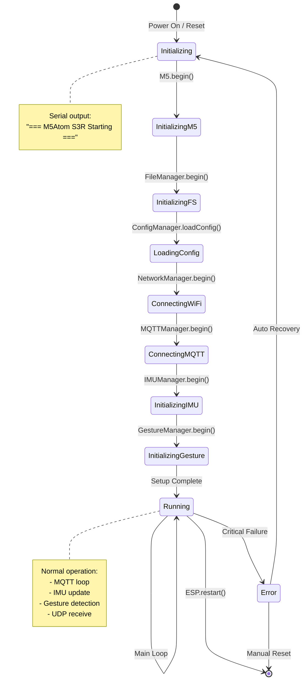
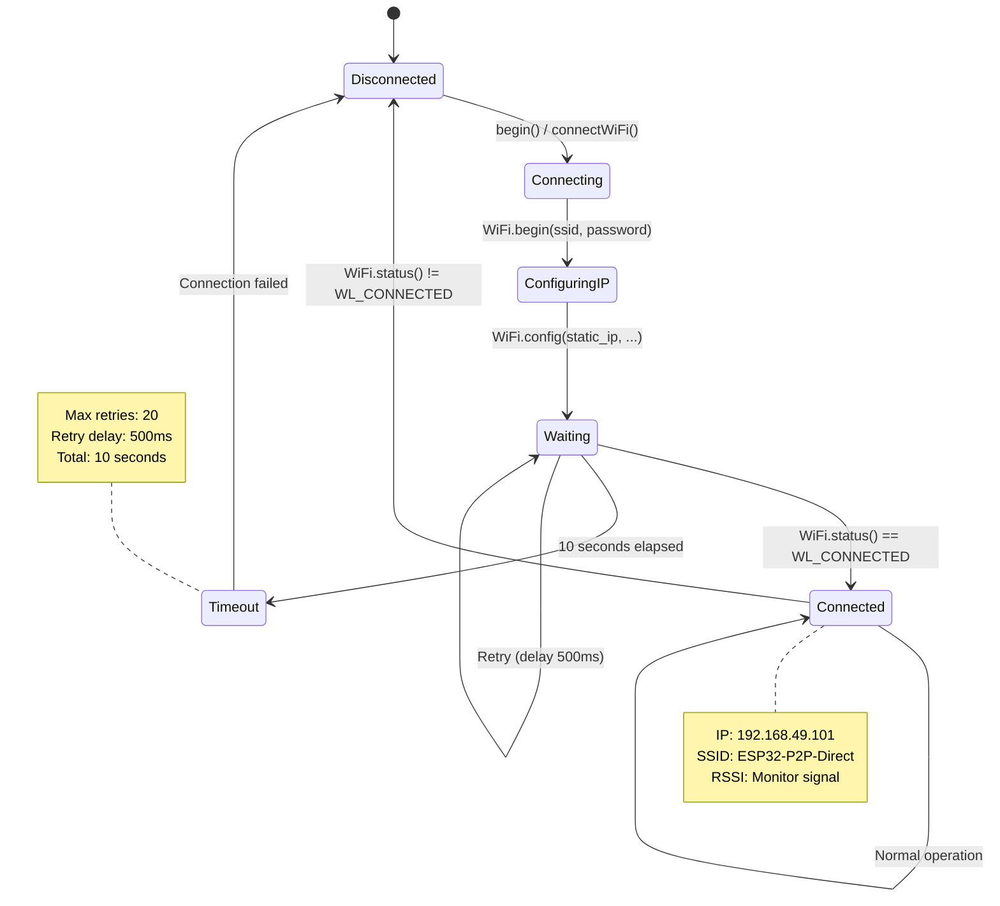
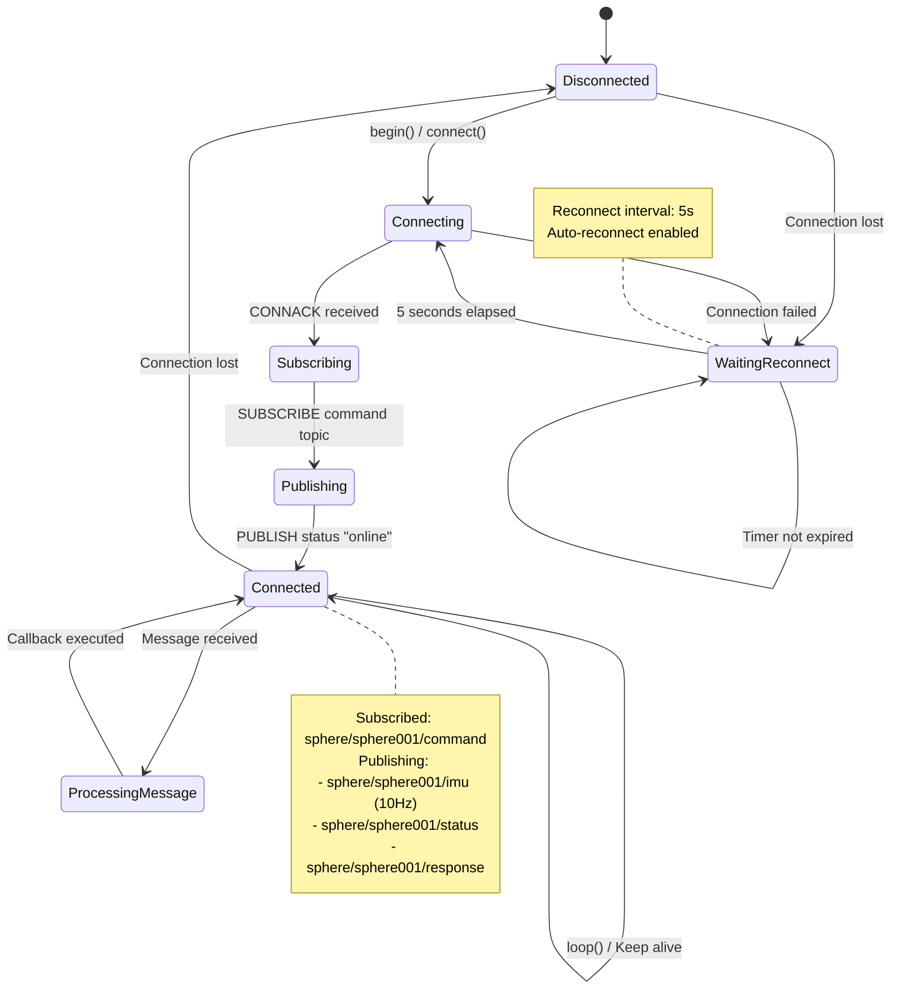
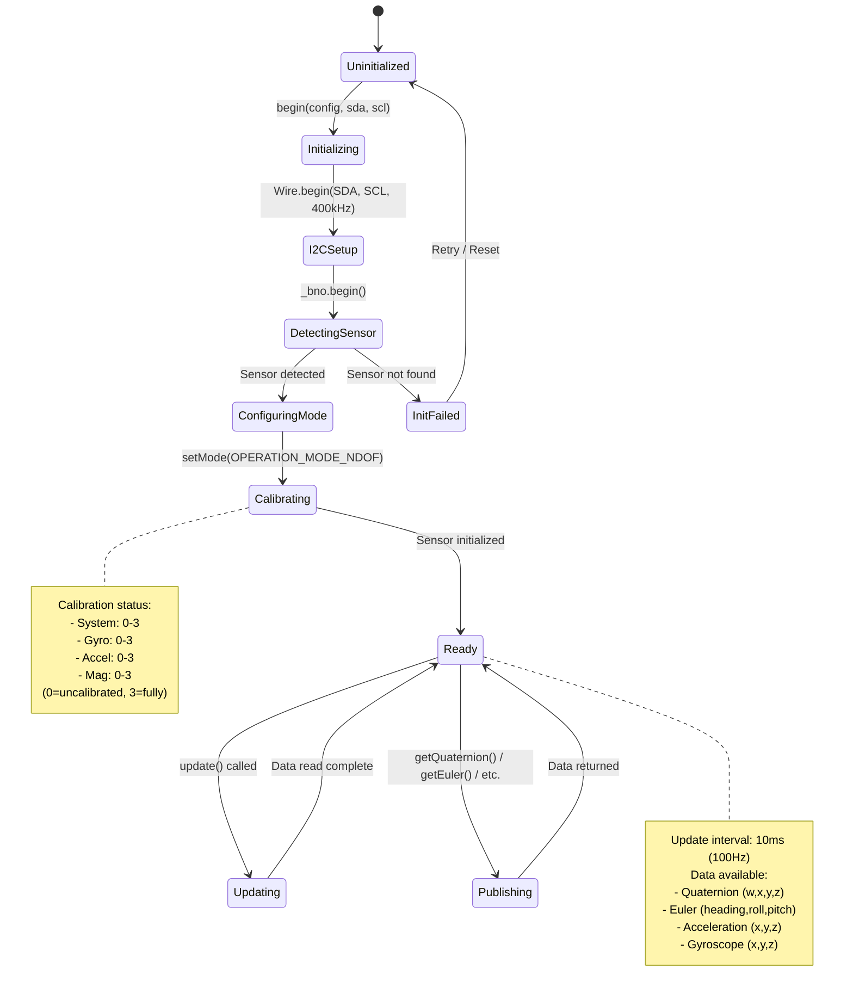
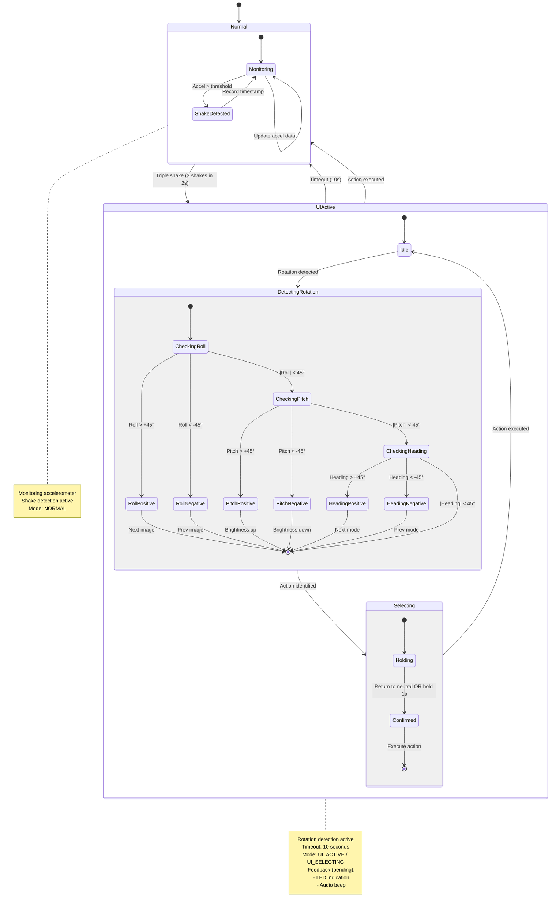
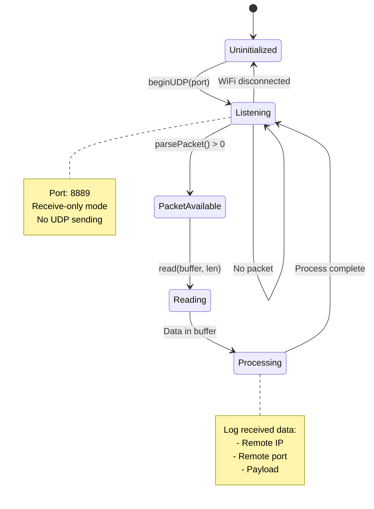
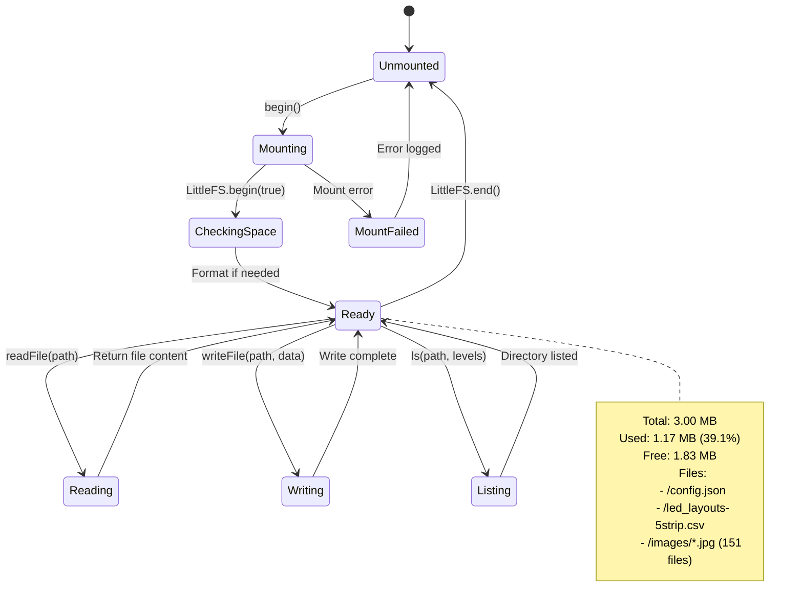
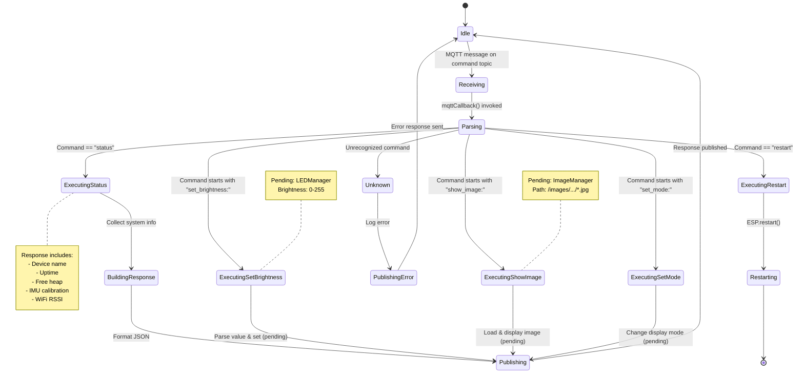
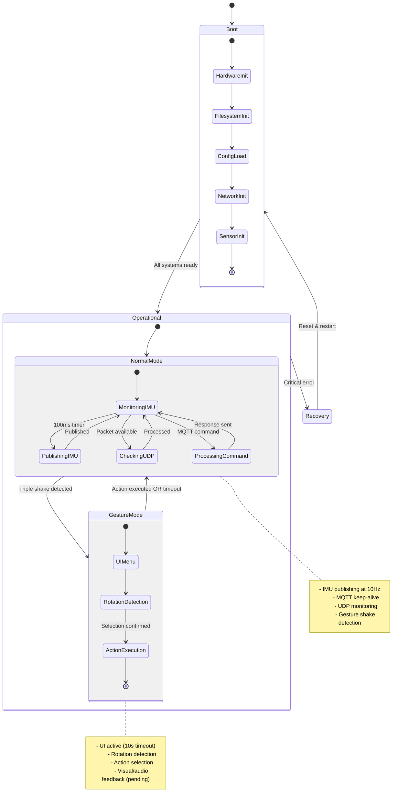

> **English** · [日本語](state.ja.md)

# State Diagrams

## Overall System State Transitions

## WiFi Connection State

## MQTT Connection State

## IMU State Transitions

## Gesture Detection State (planned)

## UDP Reception State

## File System State

## Command Processing State

## Overall Mode State (Integrated View)

