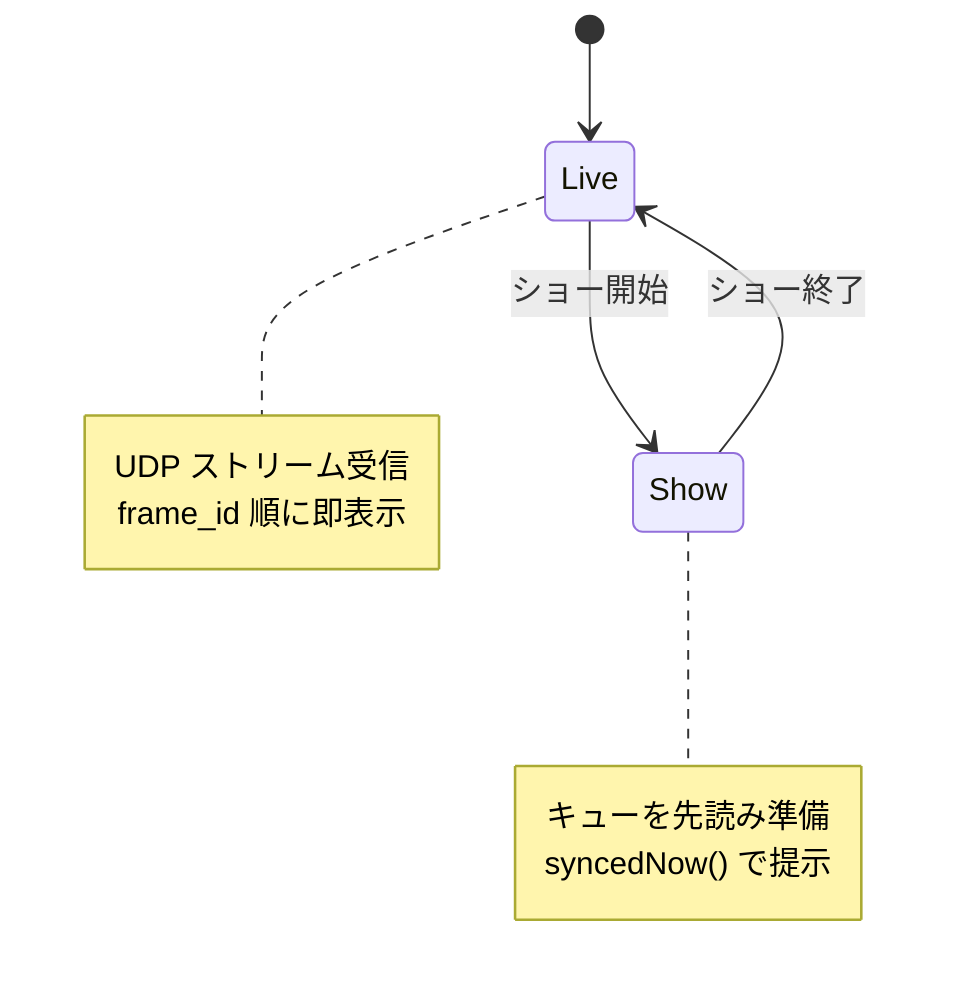

> [English](time_sync_show.md) · **日本語**

# 時刻同期・スケジュール表示 (ショーモード) 設計

## 概要

複数コア (球体) を **共通の時間軸** で協調させ、音楽や演出に合わせて
画像・パターンを一斉に、あるいは球ごとに役割分担して表示するための設計。

目的は「現実の壁掛け時計」を得ることではなく、**全コアが合意した単調増加の
共通タイムベース**を持つこと。これにより

1. 複数コアのパターンを音楽に同期させる／組み合わせる
2. ある時刻に表示するコンテンツを **事前に用意** しておき、時刻同期して一斉提示する
3. (副次的) ログのタイムスタンプ・イベント相関など汎用の時刻としても使える

を実現する。

### 設計上の核心

> コンテンツを事前に用意しておくと、「リアルタイム配信の同期問題」が
> 「スケジュール提示問題」に変わる。ネットワークのジッタは *事前に届いていればいい*
> だけになり、**表示の瞬間には効かなくなる**。表示時刻にやる仕事は
> 「用意済みバッファを差し替える」だけ (数µs) なので、同期精度はほぼクロック精度に収束する。

### 同期精度の要件

- 目標: **10ms 程度** (ヒトが「同期している」と感じる範囲内)
- この設計ではクロック精度が律速となり、10ms 目標は十分に達成可能。

---

## 1. 共通クロック (TimeSync)

### 方式

サーバーを時刻の権威とし、**1秒周期で MQTT ブロードキャスト**する時刻ビーコンを
各コアが受信、間はローカルクロック (`millis()`) で補間する。

```
sphere/all/clock (1秒周期, QoS0, retain=false)
  { "epoch_ms": 1751940000123, "seq": 42 }
```

各コアは受信時に offset を求め、以降は補間する:

```
offset      = epoch_ms - millis()            // 受信時に算出
syncedNow() = millis() + offset_filtered     // 全コア共通のエポック ms
```

### 設計の勘所

| # | 論点 | 方針 |
|---|------|------|
| 1 | ビーコンの役割 | ESP32 水晶ドリフトは 40ppm ≒ **40µs/秒**。1秒間隔なら溜まるズレは数十µsで無視できる。ビーコンの本質は**ドリフト補正**であって、ジッタとの戦いではない。1秒は十分に保守的。 |
| 2 | offset を毎回スナップしない | 素直に毎ビーコンで `offset` を上書きすると **WiFi ジッタがそのままクロックに注入され表示がカクつく**。→ **EMA (指数移動平均) でローパス** し、明らかな外れ値ビーコンは棄却。補正はスルー (緩やかに寄せる) して表示ジャンプを防ぐ。 |
| 3 | WiFi モデムスリープ無効化 | ESP32 はデフォルトで省電力スリープに入り、受信が数十msスパイクする。同期用途では致命的なので起動時に `WiFi.setSleep(false)` (`WIFI_PS_NONE`)。 |
| 4 | QoS / retain | clock は **QoS0・非retain**。再送遅延で古い時刻が届くのを避ける (古さは payload の epoch_ms で自明)。 |
| 5 | 相対スキュー | 問題になるのはコア間の相対ズレ。全コアが同一フィルタで平滑化すれば相対スキューは小さく収まる。 |

### 精度の律速

- クロックそのものは `millis()` (ms 分解能) で保持。
- 実効精度の律速は **MQTT/WiFi の片道遅延ジッタ** (通常数ms、たまにスパイク)。
  上記の EMA + 外れ値棄却で吸収し、10ms 目標に収める。

---

## 2. スケジュール表示 (キューリスト + 先読みプリフェッチ)

### パイプライン

既存の三重バッファ (`FrameBufferPool`: display / ready / decode) をそのまま活用する。
ライブ配信ではなく「スケジュール提示」に使うだけ。

```
[準備フェーズ]  present_at より前に decode バッファへ用意する
                 ・保存画像なら LittleFS (/images/) から読み → JPEG デコード
                 ・パターンなら f(syncedNow(), role, params) で生成
                 完了したら ready に積む (= この時点までに間に合わせる)

[提示フェーズ]  表示ループで syncedNow() を監視
                 syncedNow() >= cue.present_at になった瞬間に ready → display フリップ
                 (テアリングなし・ほぼ0コスト)
```

先読みのリードタイムは **最悪デコード時間より長く**取る。
`ImageManager` は既に `decode_time_us` を計測しているので、実測値から決定する
(例: 最悪 30ms なら 100ms 前に準備開始)。

### 端の処理

| 状況 | 挙動 |
|------|------|
| `syncedNow()` が present_at を少し超過 (< 10ms) | 即提示 (遅延最小) |
| 大きく超過 (遅延参加・クロック飛び) | 過去キューはスキップし、現在時刻のキューへ追従 |
| まだ present_at 前 | **絶対に先出ししない** (必ず時刻まで待つ) |

### メモリ

ESP32-S3 + PSRAM (`BOARD_HAS_PSRAM`)。128×128×16bit ≒ 32KB/枚なので、
数枚先まで準備済みリングにしても余裕がある。

---

## 3. コンテンツモデル / プロトコル

キューは絶対時刻を持つので、クロックさえ同期していれば全コアが自律的に揃う。

```
sphere/all/cues (QoS1, 事前配布)
  [ { "present_at_epoch_ms": 1751940003000, "type": "image",   "id": "img_042" },
    { "present_at_epoch_ms": 1751940003500, "type": "pattern", "gen": "pulse",
      "role": "A", "params": { ... } },
    ... ]
```

| type | 意味 | 準備処理 |
|------|------|----------|
| `image` | `/images/` の保存画像を id 参照 | 事前読み込み + JPEG デコード |
| `pattern` | 生成パターン | `f(syncedNow(), role, params)` で生成 |

- **パターンは同期時刻の純粋関数** `LED出力 = f(syncedNow(), role, params)` とする。
  これにより全コアが構造的にフレームロックする (offset 合わせだけでは揃わない点に注意)。
- **「組み合わせ」** は `f` に coreId / 役割 (role) を渡すことで実現。
  球ごとに違う担当パートを同一時間軸で演じられる。

ショー全体の振り付けはキューリストとして事前配布する。必要なら BPM・開始時刻を持つ
上位の「ショー定義」を別トピックで配ってもよい:

```
sphere/all/show (ショー切替時, QoS1)
  { "show": "pulse", "start_epoch_ms": ..., "bpm": 120, "roles": { ... } }
```

---

## 4. ライブモードとの共存

既存の UDP ストリーム (`FrameReassembler`, frame_id ベース, PTS なし) は
**ライブミラー**としてそのまま残す。本設計の「ショー (スケジュール) モード」は
**別の再生モード**として追加する (フロントに既にある "live デジタルツイン" と対になる)。



---

## 5. 追加コンポーネント

| 層 | 追加するもの |
|----|-------------|
| server | `sphere/all/clock` を1秒周期で publish するループ。`sphere/all/cues` の配布。既存 `datetime.utcnow()` を epoch ms (整数) で送る。 |
| core `TimeSync` (新規) | clock 購読 → offset を EMA 平滑化・`syncedNow()` 提供・定期再同期 |
| core `CommandHandler` | `sphere/all/clock` の分岐追加 / `CommandHandler.cpp:301` の `timestamp` TODO を `syncedNow()` で解消 |
| core `CueScheduler` (新規) | ソート済みキュー保持・「次に準備すべきもの」「提示時刻か」を判定 |
| core プリフェッチ処理 | present_at 前に decode / 生成して ready に積む |
| core 表示ループ | `syncedNow() >= present_at` で ready → display フリップ |
| core 起動時 | `WiFi.setSleep(false)` |

---

## 未確定 / 今後の論点

- キューの配布単位 (1曲まるごと事前配布か、時間窓でストリーミング配布か)
- パターン生成関数 `f` の設計 (どんな生成器を用意するか)
- 役割 (role) の割り当て方法 (config.json の sphere.id からの静的割当 / サーバー動的割当)
- サーバー側時刻配布の実装場所 (`mqtt_service.py` にループを足すか、専用サービスにするか)
