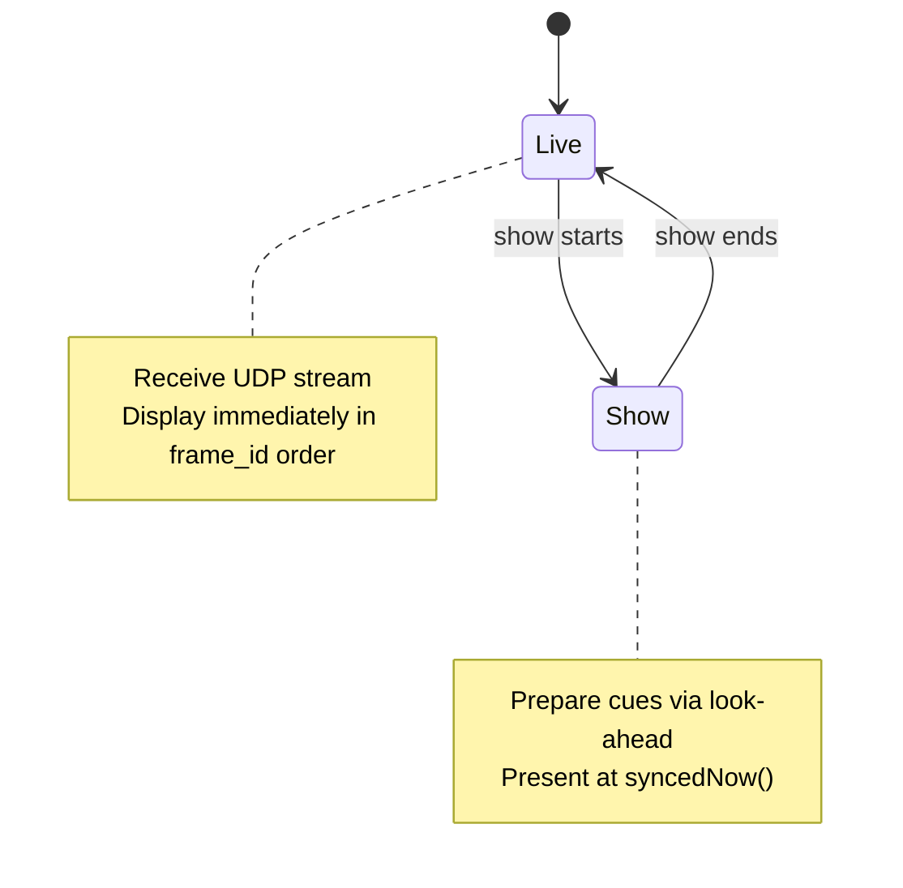

> **English** · [日本語](time_sync_show.ja.md)

# Time Synchronization and Scheduled Display (Show Mode) Design

## Overview

A design for coordinating multiple cores (spheres) on a **shared time axis**, so that images and patterns can be displayed all at once, or with roles divided among spheres, in time with music and performances.

The goal is not to obtain a "real-world wall clock," but rather to have a **shared, monotonically increasing time base that all cores agree on**. This enables:

1. Synchronizing / combining the patterns of multiple cores with music
2. **Preparing content in advance** that is to be displayed at a given time, and presenting it all at once via time synchronization
3. (As a side benefit) use as a general-purpose clock for log timestamps, event correlation, and so on

### The Core of the Design

> When content is prepared in advance, the "synchronization problem of real-time streaming" turns into a "scheduled presentation problem." Network jitter only needs *to have delivered the content beforehand*, and **no longer matters at the moment of display**. The only work done at display time is "swapping in an already-prepared buffer" (a few µs), so the synchronization accuracy converges to essentially the clock accuracy.

### Synchronization Accuracy Requirements

- Target: **around 10ms** (within the range where a human perceives it as "synchronized")
- In this design, clock accuracy is the limiting factor, and the 10ms target is readily achievable.

---

## 1. Shared Clock (TimeSync)

### Method

The server is the authority on time, and **broadcasts a time beacon over MQTT with a 1-second period**. Each core receives it, and interpolates in between using its local clock (`millis()`).

```
sphere/all/clock (1-second period, QoS0, retain=false)
  { "epoch_ms": 1751940000123, "seq": 42 }
```

Each core computes an offset on reception, then interpolates thereafter:

```
offset      = epoch_ms - millis()            // computed on reception
syncedNow() = millis() + offset_filtered     // epoch ms shared across all cores
```

### Design Considerations

| # | Point | Approach |
|---|------|------|
| 1 | Role of the beacon | ESP32 crystal drift is 40ppm ≒ **40µs/second**. At a 1-second interval, the accumulated deviation is a few tens of µs and can be ignored. The essence of the beacon is **drift correction**, not a fight against jitter. 1 second is sufficiently conservative. |
| 2 | Do not snap the offset every time | Naively overwriting `offset` on every beacon means **WiFi jitter is injected directly into the clock, making the display stutter**. → **Low-pass it with an EMA (exponential moving average)** and reject clearly outlying beacons. Apply corrections gradually (easing toward the value) to prevent display jumps. |
| 3 | Disable WiFi modem sleep | By default the ESP32 enters power-saving sleep, causing reception latency to spike by tens of ms. This is fatal for synchronization purposes, so call `WiFi.setSleep(false)` (`WIFI_PS_NONE`) at startup. |
| 4 | QoS / retain | clock is **QoS0 and non-retain**. This avoids stale times arriving due to retransmission delay (staleness is self-evident from the payload's epoch_ms). |
| 5 | Relative skew | What matters is the relative deviation between cores. If all cores smooth with the same filter, the relative skew stays small. |

### The Limiting Factor for Accuracy

- The clock itself is held with `millis()` (ms resolution).
- The limiting factor for effective accuracy is the **one-way latency jitter of MQTT/WiFi** (usually a few ms, with occasional spikes).
  This is absorbed by the EMA + outlier rejection above, keeping it within the 10ms target.

---

## 2. Scheduled Display (Cue List + Look-Ahead Prefetch)

### Pipeline

The existing triple buffer (`FrameBufferPool`: display / ready / decode) is used as-is, simply repurposed for "scheduled presentation" rather than live streaming.

```
[Preparation phase]  Prepare into the decode buffer before present_at
                     - For a stored image, read from LittleFS (/images/) → JPEG decode
                     - For a pattern, generate via f(syncedNow(), role, params)
                     When done, push onto ready (= must be ready by this point)

[Presentation phase]  The display loop monitors syncedNow()
                     The instant syncedNow() >= cue.present_at, flip ready → display
                     (no tearing, near-zero cost)
```

The look-ahead lead time is set **longer than the worst-case decode time**.
Since `ImageManager` already measures `decode_time_us`, decide it from the measured values
(e.g., if the worst case is 30ms, start preparing 100ms ahead).

### Edge Handling

| Situation | Behavior |
|------|------|
| `syncedNow()` slightly exceeds present_at (< 10ms) | Present immediately (minimize latency) |
| Greatly exceeded (late join, clock jump) | Skip past cues and follow the cue for the current time |
| Still before present_at | **Never present early** (always wait until the scheduled time) |

### Memory

ESP32-S3 + PSRAM (`BOARD_HAS_PSRAM`). At 128×128×16bit ≒ 32KB/frame, there is ample room even for a ring prepared several frames ahead.

---

## 3. Content Model / Protocol

Since cues carry absolute times, all cores align autonomously as long as the clock is synchronized.

```
sphere/all/cues (QoS1, distributed in advance)
  [ { "present_at_epoch_ms": 1751940003000, "type": "image",   "id": "img_042" },
    { "present_at_epoch_ms": 1751940003500, "type": "pattern", "gen": "pulse",
      "role": "A", "params": { ... } },
    ... ]
```

| type | Meaning | Preparation |
|------|------|----------|
| `image` | References a stored image in `/images/` by id | Preload + JPEG decode |
| `pattern` | Generated pattern | Generate via `f(syncedNow(), role, params)` |

- **A pattern is a pure function of the synchronized time**: `LED output = f(syncedNow(), role, params)`.
  This makes all cores structurally frame-locked (note that offset alignment alone does not align them).
- **"Combination"** is achieved by passing coreId / role to `f`.
  Each sphere can play a different assigned part on the same time axis.

The choreography of the whole show is distributed in advance as a cue list. If needed, a higher-level "show definition" carrying BPM and a start time can be distributed on a separate topic:

```
sphere/all/show (on show change, QoS1)
  { "show": "pulse", "start_epoch_ms": ..., "bpm": 120, "roles": { ... } }
```

---

## 4. Coexistence with Live Mode

The existing UDP stream (`FrameReassembler`, frame_id-based, no PTS) remains as-is as a **live mirror**. The "show (scheduled) mode" of this design is added as a **separate playback mode** (paired with the "live digital twin" that already exists in the frontend).



---

## 5. Additional Components

| Layer | What to add |
|----|-------------|
| server | A loop that publishes `sphere/all/clock` with a 1-second period. Distribution of `sphere/all/cues`. Sends the existing `datetime.utcnow()` as epoch ms (integer). |
| core `TimeSync` (new) | Subscribe to clock → EMA-smooth the offset, provide `syncedNow()`, periodic resynchronization |
| core `CommandHandler` | Add a branch for `sphere/all/clock` / resolve the `timestamp` TODO at `CommandHandler.cpp:301` using `syncedNow()` |
| core `CueScheduler` (new) | Hold a sorted queue of cues, decide "what to prepare next" and "whether it is presentation time" |
| core prefetch processing | Decode / generate before present_at and push onto ready |
| core display loop | Flip ready → display when `syncedNow() >= present_at` |
| core startup | `WiFi.setSleep(false)` |

---

## Open Questions / Future Points

- Distribution unit for cues (distribute a whole song in advance, or stream-distribute in time windows)
- Design of the pattern generation function `f` (what generators to provide)
- Method for assigning roles (static assignment from sphere.id in config.json / dynamic assignment by the server)
- Where to implement server-side time distribution (add a loop to `mqtt_service.py`, or a dedicated service)
