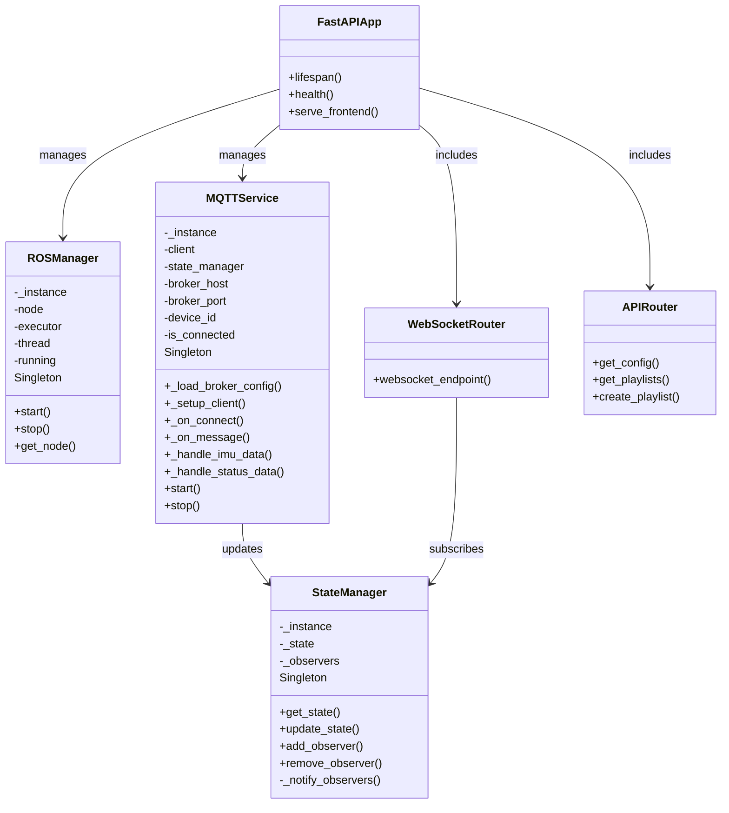
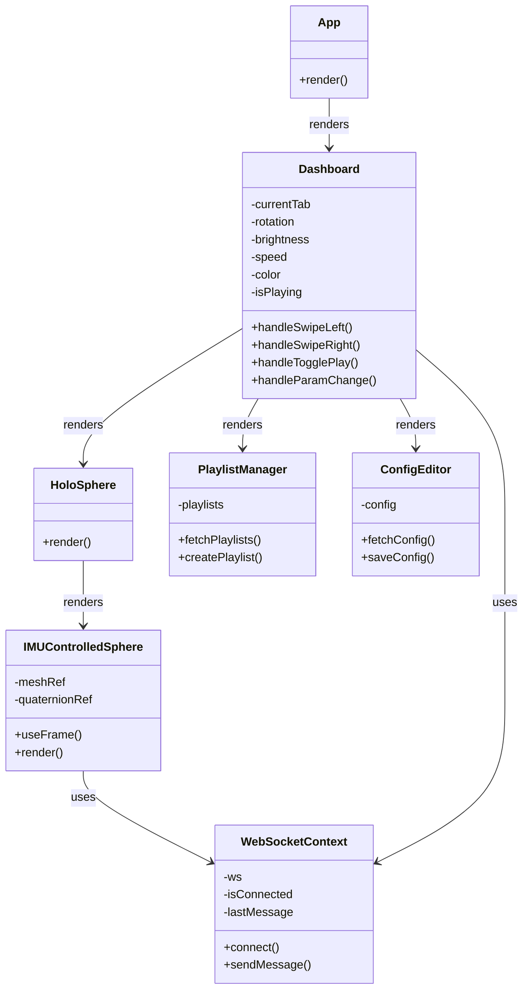
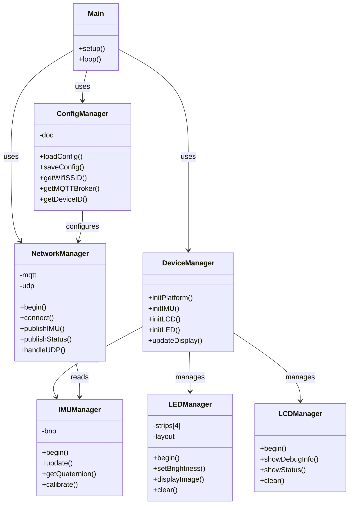
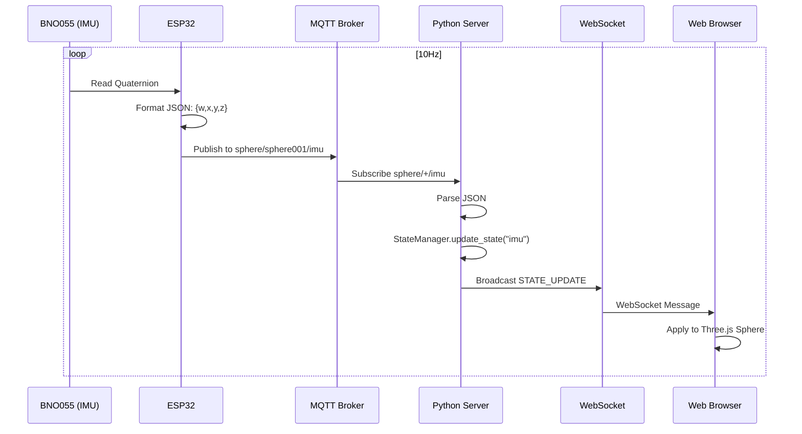
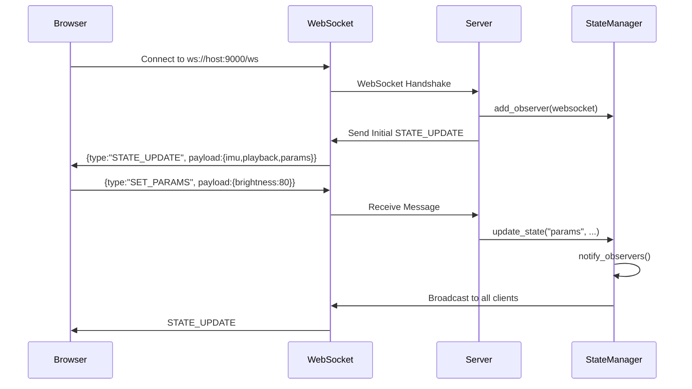

# クラス図とコンポーネント構成

最終更新: 2025-12-02

## Python Server クラス構成



## React Frontend コンポーネント構成



## ESP32 クラス構成



## データフロー

### IMU Quaternion データフロー



### WebSocket 状態同期



## ファイル構成

### Server
```
server/
├── app/
│   ├── main.py                 # FastAPI application
│   ├── core/
│   │   ├── config.py          # Settings
│   │   └── ros_manager.py     # ROS2 Manager (Singleton)
│   ├── services/
│   │   ├── mqtt_service.py    # MQTT Client (Singleton)
│   │   └── state_manager.py   # State Manager (Singleton)
│   └── api/
│       ├── router.py          # API Router
│       └── endpoints/
│           ├── websocket.py   # WebSocket endpoint
│           ├── config.py      # Config API
│           └── playlist.py    # Playlist API
└── frontend/
    ├── src/
    │   ├── App.jsx
    │   ├── contexts/
    │   │   └── WebSocketContext.jsx
    │   ├── pages/
    │   │   └── Dashboard.jsx
    │   └── components/
    │       ├── sphere/
    │       │   └── HoloSphere.jsx
    │       ├── playlist/
    │       │   └── PlaylistManager.jsx
    │       └── params/
    │           └── ConfigEditor.jsx
    └── dist/                  # Built files
```

### ESP32
```
core/
├── src/
│   ├── main.cpp               # Main entry point
│   ├── ConfigManager.cpp/h    # JSON config loader
│   ├── DeviceManager.cpp/h    # Platform initialization
│   ├── NetworkManager.cpp/h   # MQTT/UDP handler
│   ├── IMUManager.cpp/h       # BNO055 wrapper
│   ├── LEDManager.cpp/h       # FastLED controller
│   └── LCDManager.cpp/h       # M5Unified display
├── data/                      # LittleFS files
│   ├── config.json            # System config
│   ├── led_layout.csv         # LED positions
│   └── images/                # Image files
└── platformio.ini             # Build config
```

## Singleton パターン

以下のクラスはSingletonパターンで実装されています：

- **Python Server**
  - `ROSManager`: ROS2ノード管理
  - `MQTTService`: MQTT接続管理
  - `StateManager`: グローバル状態管理

理由：
- アプリケーション全体で単一のインスタンスが必要
- リソース（ネットワーク接続、スレッド）の重複を防ぐ
- 状態の一貫性を保証

## 非同期処理

### Python Server
- FastAPI: ASGI非同期フレームワーク
- WebSocket: 非同期ハンドラ
- StateManager: `async def update_state()`で非同期通知
- MQTTService: 別スレッドで動作、`asyncio.new_event_loop()`で同期

### Frontend
- WebSocket: イベントドリブン
- React Hooks: `useEffect`, `useState`で非同期更新
- Three.js: `useFrame`でアニメーションループ
