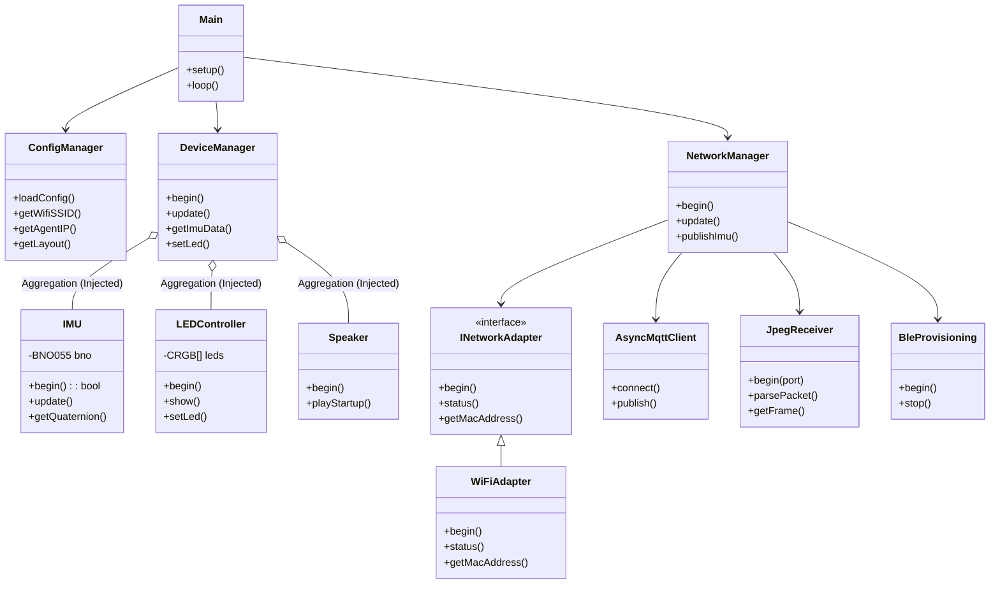

# システムアーキテクチャ

## クラス図

## 責務の割り当て (Responsibility Assignment)

### 1. DeviceManager (プラットフォーム管理 & 統合ファサード)
*   **役割**: システム基盤の初期化と、各コンポーネントの連携を管理する。
*   **責務**:
    *   **プラットフォーム初期化**: `M5.begin()`, PSRAMチェック, ファイルシステム (`LittleFS`) のマウント。
    *   **コンポーネント連携**: 注入された `IMU`, `LEDController`, `Speaker` を保持し、メインループからの更新要求 (`update`) を各コンポーネントに移譲する。
    *   **初期化の除外**: サブコンポーネント (`IMU` 等) の `begin()` は呼び出さない（`setup()` で実施済みである前提）。

### 2. IMU (センサーラッパー)
*   **役割**: BNO055センサーの管理を行う。
*   **責務**:
    *   **I2Cバス初期化**: 必要に応じて `Wire.begin()` を管理する。
    *   **センサー検出**: BNO055が接続されているか確認する。
    *   **データ取得**: クォータニオンデータを読み出す。

### 3. LEDController (視覚出力)
*   **役割**: LEDストリップの管理を行う。
*   **責務**:
    *   **FastLED初期化**: 全ストリップに対して `FastLED.addLeds()` を実行する。
    *   **バッファ管理**: RGBデータの保持と更新を行う。

### 4. NetworkManager (通信)
*   **役割**: 外部との接続性を管理する。
*   **責務**:
    *   **アダプタ管理**: `INetworkAdapter` を通じてWi-Fiを初期化する。
    *   **MQTT**: 接続維持とPub/Sub処理を行う。
    *   **UDP**: `JpegReceiver` を通じて映像ストリームを受信する。
    *   **BLE**: `BleProvisioning` を通じてWi-Fi設定を受け取る。

### 5. INetworkAdapter (抽象化レイヤ)
*   **役割**: 基礎となるネットワークハードウェア (Wi-Fi) を抽象化する。
*   **責務**:
    *   **ハードウェア初期化**: `WiFi.begin()`, `WiFi.macAddress()` などの呼び出し。
    *   **ステータス確認**: `WiFi.status()` のラップ。

## テスト戦略 (Testing Strategy)
*   **TestDeviceManager**: プラットフォーム初期化 (M5, PSRAM, FS) と、コンポーネントへの移譲ロジックをテストする。
*   **TestIMU**: I2Cバスの初期化と、BNO055の応答確認を検証する。
*   **TestLEDController**: FastLEDの初期化シーケンスを検証する。
*   **TestNetworkAdapter**: Wi-Fiアダプタの初期化と、MACアドレス取得を検証する。
