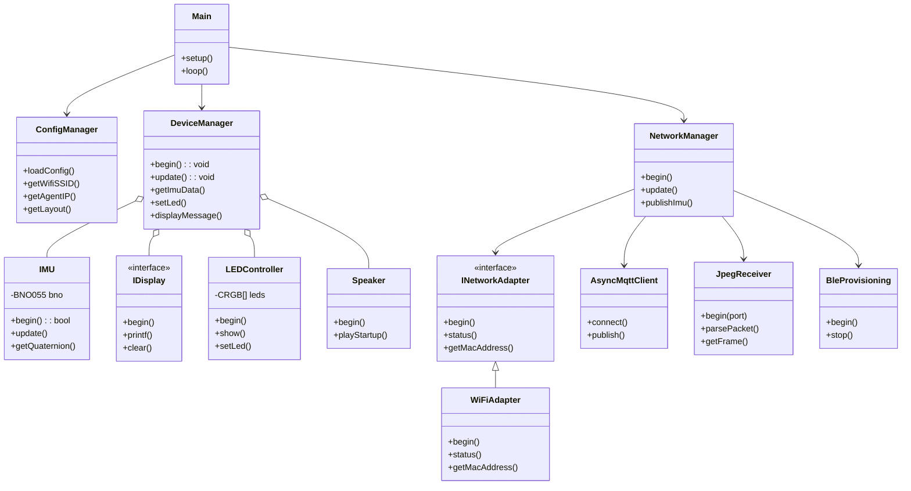

# Class Diagram

```mermaid
classDiagram
    class Main {
        +setup()
        +loop()
    }

    class ConfigManager {
        +loadConfig()
        +getWifiSSID()
        +getAgentIP()
        +getLayout()
    }

    class DeviceManager {
        +begin() : void
        +update() : void
        +getImuData()
        +setLed()
        +displayMessage()
    }

    class IMU {
        -BNO055 bno
        +begin() : bool
        +update()
        +getQuaternion()
    }

    class IDisplay {
        <<interface>>
        +begin()
        +printf()
        +clear()
    }

    class LEDController {
        -CRGB[] leds
        +begin()
        +show()
        +setLed()
    }

    class Speaker {
        +begin()
        +playStartup()
    }

    class NetworkManager {
        +begin()
        +update()
        +publishImu()
    }

    class INetworkAdapter {
        <<interface>>
        +begin()
        +status()
        +getMacAddress()
    }

    class WiFiAdapter {
        +begin()
        +status()
        +getMacAddress()
    }

    class AsyncMqttClient {
        +connect()
        +publish()
    }

    class JpegReceiver {
        +begin(port)
        +parsePacket()
        +getFrame()
    }

    class BleProvisioning {
        +begin()
        +stop()
    }

    Main --> ConfigManager
    Main --> DeviceManager
    Main --> NetworkManager

    %% Dependency Injection (Aggregation)
    DeviceManager o-- IMU
    DeviceManager o-- LEDController
    DeviceManager o-- Speaker
    DeviceManager o-- IDisplay

    NetworkManager --> INetworkAdapter
    NetworkManager --> AsyncMqttClient
    NetworkManager --> JpegReceiver
    NetworkManager --> BleProvisioning
    INetworkAdapter <|-- WiFiAdapter
```
