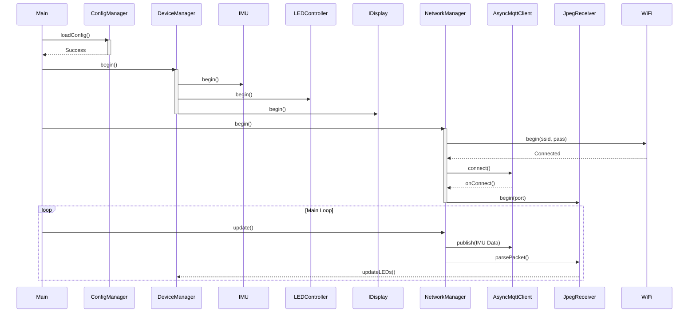
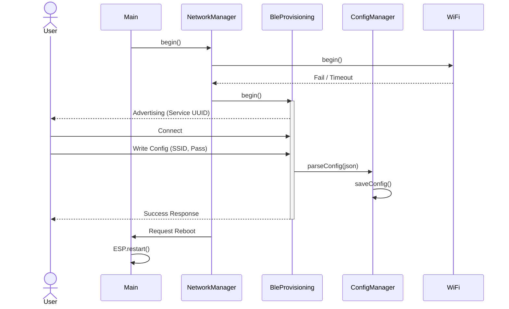

# Sequence Diagram (シーケンス図)

複数のコンポーネントが連携して動作するフロー（特に起動時とプロビジョニング）を可視化します。

## 1. Startup Sequence (正常起動)

```mermaid
sequenceDiagram
    participant Main
    participant Config as ConfigManager
    participant Device as DeviceManager
    participant IMU
    participant LEDController
    participant Display as IDisplay
    participant Network as NetworkManager
    participant MQTT as AsyncMqttClient
    participant UDP as JpegReceiver

    Main->>Config: loadConfig()
    activate Config
    Config-->>Main: Success
    deactivate Config

    Main->>Device: begin()
    activate Device
    Device->>IMU: begin()
    Device->>LEDController: begin()
    Device->>Display: begin()
    deactivate Device

    Main->>Network: begin()
    activate Network
    Network->>WiFi: begin(ssid, pass)
    WiFi-->>Network: Connected
    
    Network->>MQTT: connect()
    MQTT-->>Network: onConnect()
    
    Network->>UDP: begin(port)
    deactivate Network

    loop Main Loop
        Main->>Network: update()
        Network->>MQTT: publish(IMU Data)
        Network->>UDP: parsePacket()
        UDP-->>Device: updateLEDs()
    end
```

## 2. BLE Provisioning Flow (設定なし/接続失敗)

```mermaid
sequenceDiagram
    actor User
    participant Main
    participant Network as NetworkManager
    participant BLE as BleProvisioning
    participant Config as ConfigManager

    Main->>Network: begin()
    Network->>WiFi: begin()
    WiFi-->>Network: Fail / Timeout
    
    Network->>BLE: begin()
    activate BLE
    BLE-->>User: Advertising (Service UUID)
    
    User->>BLE: Connect
    User->>BLE: Write Config (SSID, Pass)
    
    BLE->>Config: parseConfig(json)
    Config->>Config: saveConfig()
    
    BLE-->>User: Success Response
    deactivate BLE
    
    Network->>Main: Request Reboot
    Main->>Main: ESP.restart()
```
