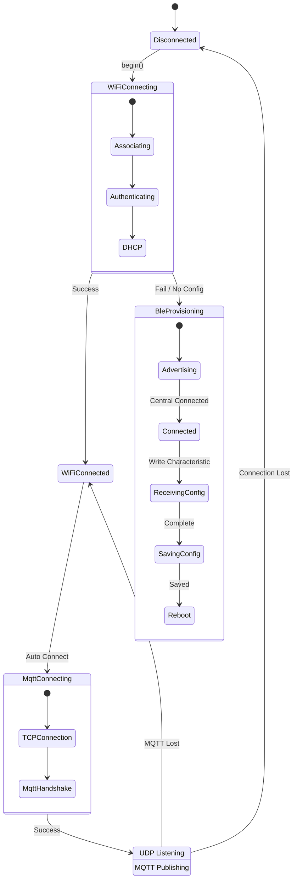

# State Machine Diagram (状態遷移図)

組み込みシステム、特にネットワーク接続を伴うシステムでは、現在の状態（State）を明確に定義することが不可欠です。

## NetworkManager State Machine

```mermaid
stateDiagram-v2
    [*] --> Disconnected
    
    Disconnected --> WiFiConnecting : begin()
    
    state WiFiConnecting {
        [*] --> Associating
        Associating --> Authenticating
        Authenticating --> DHCP
    }
    
    WiFiConnecting --> WiFiConnected : Success
    WiFiConnecting --> BleProvisioning : Fail / No Config
    
    state BleProvisioning {
        [*] --> Advertising
        Advertising --> Connected : Central Connected
        Connected --> ReceivingConfig : Write Characteristic
        ReceivingConfig --> SavingConfig : Complete
        SavingConfig --> Reboot : Saved
    }
    
    WiFiConnected --> MqttConnecting : Auto Connect
    
    state MqttConnecting {
        [*] --> TCPConnection
        TCPConnection --> MqttHandshake
    }
    
    MqttConnecting --> Running : Success
    Running --> Disconnected : Connection Lost
    Running --> WiFiConnected : MQTT Lost
    
    Running : UDP Listening
    Running : MQTT Publishing
```
