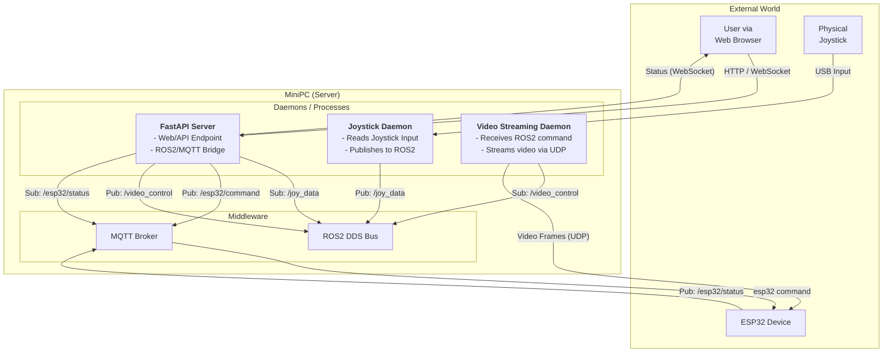

# Server Architecture

This document outlines the software architecture of the isolation-server backend, including the different daemons and their interactions.

## Component Diagram

The diagram below illustrates the main components, their roles, and the communication protocols used between them.

## Description of Daemons

### 1. FastAPI Server (The Commander & Bridge)
- **Role**: Acts as the central command/control hub and as a protocol bridge.
- **Functions**:
    - **Web Endpoint**: Serves the web UI and handles HTTP/WebSocket requests.
    - **Video Control**: Publishes control messages (e.g., play, stop) to the `/video_control` ROS2 topic based on user actions.
    - **ROS2-to-MQTT Bridge**: Subscribes to the `/joy_data` ROS2 topic, translates joystick data into commands, and publishes them to the `/esp32/command` MQTT topic.
    - **MQTT-to-Web Bridge**: Subscribes to the `/esp32/status` MQTT topic and forwards status updates to the Web UI via WebSocket.

### 2. Joystick Daemon
- **Role**: Captures and publishes physical joystick input.
- **Functions**:
    - Reads low-level events from a connected USB joystick.
    - Publishes structured joystick state data to the `/joy_data` ROS2 topic.

### 3. Video Streaming Daemon
- **Role**: Streams video content to the ESP32.
- **Functions**:
    - Subscribes to the `/video_control` ROS2 topic to receive commands.
    - Based on commands, it reads frames from a specified local video file.
    - Encodes and sends the video frames directly to the ESP32 via the UDP protocol for high-throughput transfer.

### 4. MQTT Broker
- **Role**: A lightweight message broker for ESP32-server communication.
- **Functions**:
    - Relays command messages from FastAPI to the ESP32.
    - Relays status messages from the ESP32 back to FastAPI.
    - Decouples the server from the ESP32, allowing them to connect and disconnect independently.
