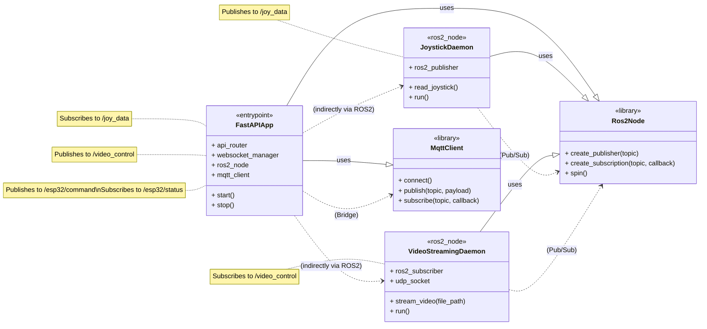

> [English](class_diagram.md) · **日本語**

# Class Diagram (Server)

This document provides a high-level conceptual class diagram for the server-side components.

## Diagram

## Description of Components

- **FastAPIApp**: The main application process. It initializes and manages both a ROS2 node and an MQTT client to act as the central bridge. It exposes the HTTP/WebSocket interface to the outside world.
- **JoystickDaemon**: A dedicated ROS2 node process that reads from a physical joystick and publishes the state to a ROS2 topic.
- **VideoStreamingDaemon**: A dedicated ROS2 node process that listens for commands on a ROS2 topic and, in response, reads a video file and streams it over UDP.
- **Ros2Node / MqttClient**: These represent the libraries or client instances used by the application daemons to interact with the respective middleware.
