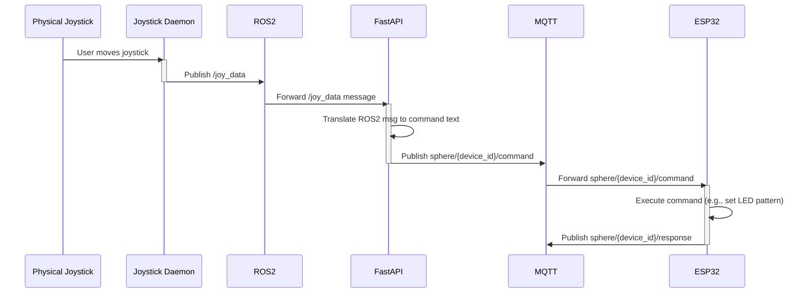
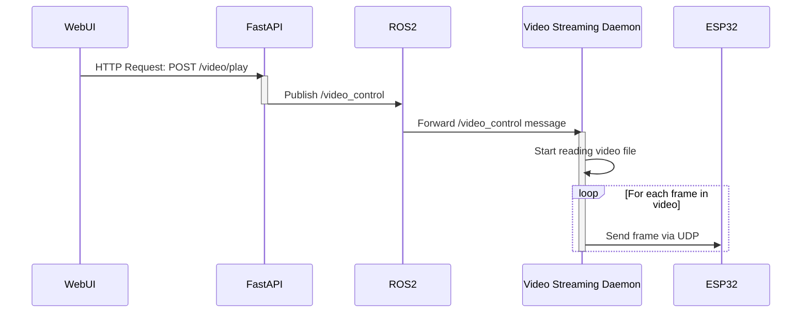
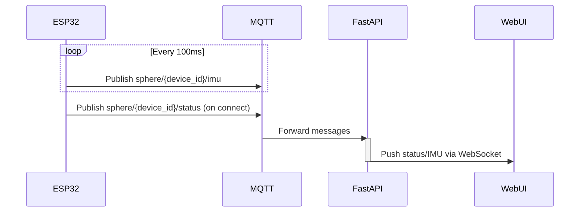

> [English](sequence_diagram.md) · **日本語**

# Sequence Diagram (Server)

This document illustrates the sequence of interactions for key use cases in the new architecture.

## 1. Joystick Control to ESP32

This diagram shows how physical joystick movements are translated into commands for the ESP32.

## 2. Web UI Initiates Video Streaming

This diagram shows how a user action on the web interface starts the video stream to the ESP32.

## 3. ESP32 Status Update to Web UI

This diagram shows how the ESP32's status is reported back to the user.

