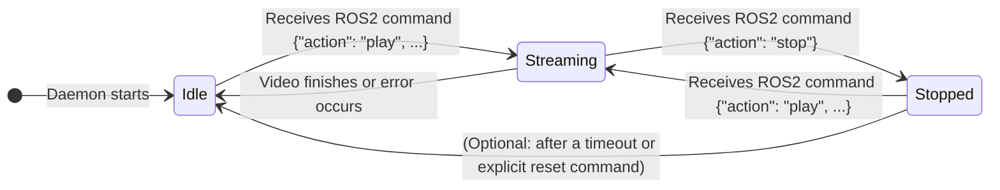
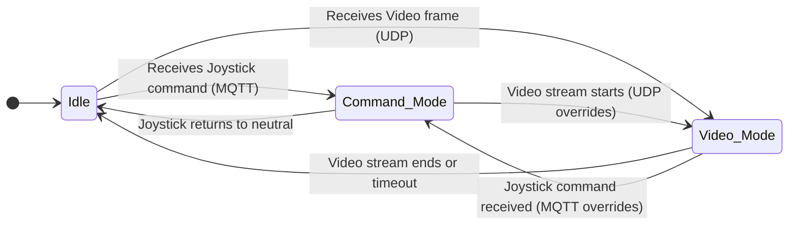

# State Diagram (Server)

This document illustrates the possible states and transitions for key components.

## 1. Video Streaming Daemon States

This diagram shows the lifecycle of the `VideoStreamingDaemon` in response to ROS2 commands.

## 2. ESP32 State (Conceptual)

This diagram shows the conceptual state of the ESP32 device as controlled by the server.

